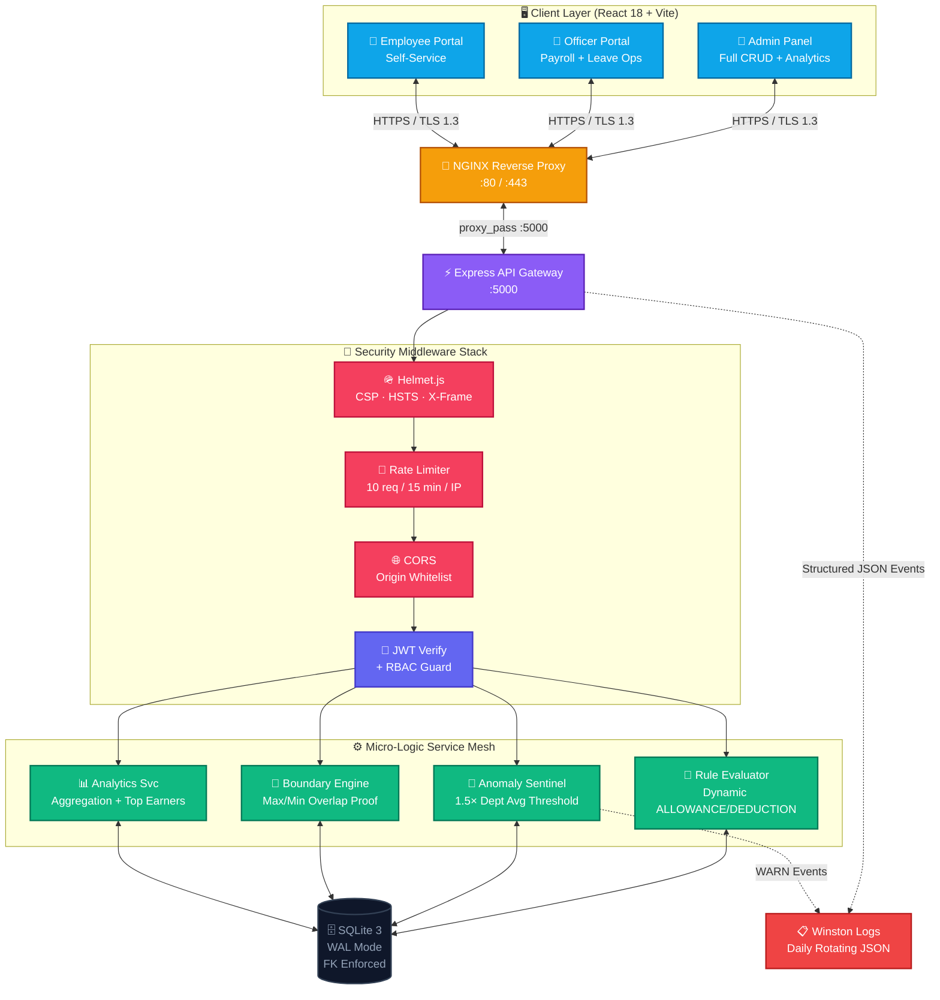
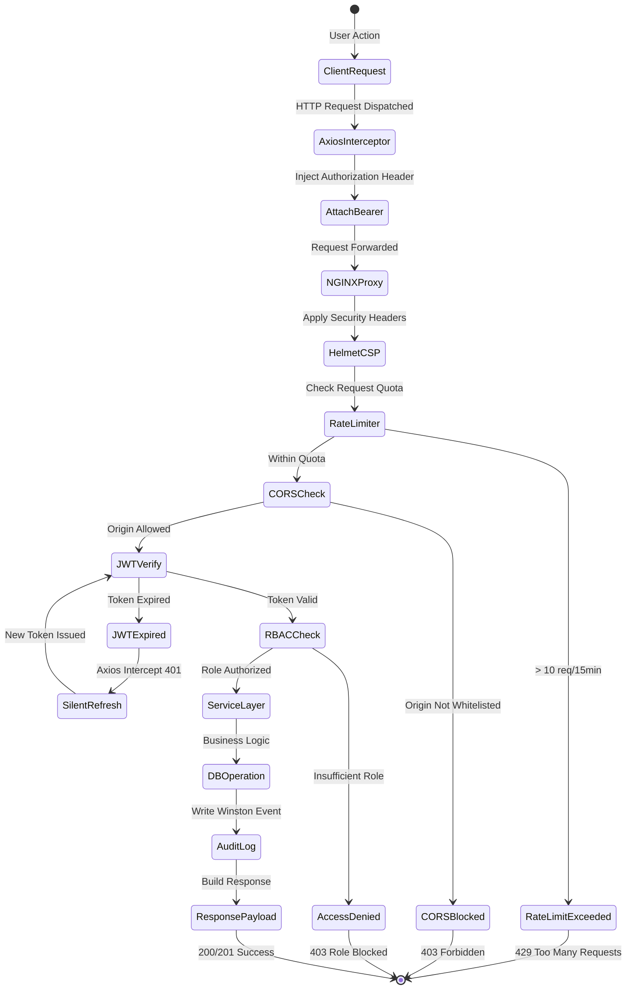
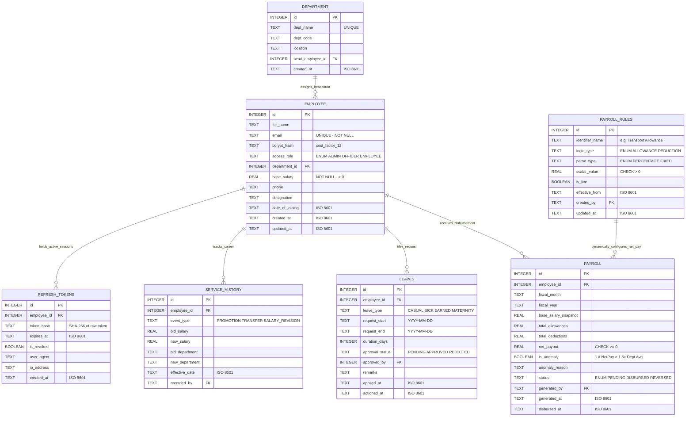
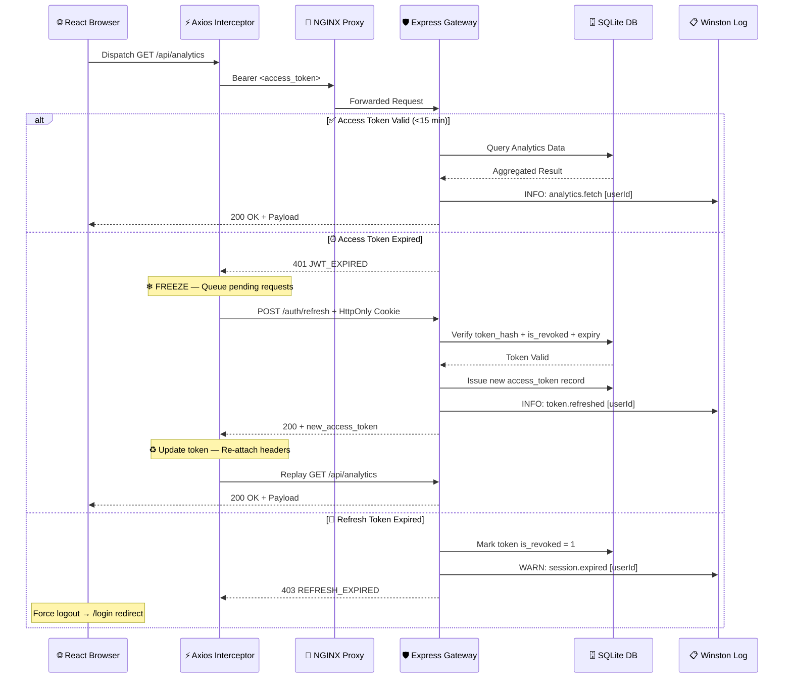
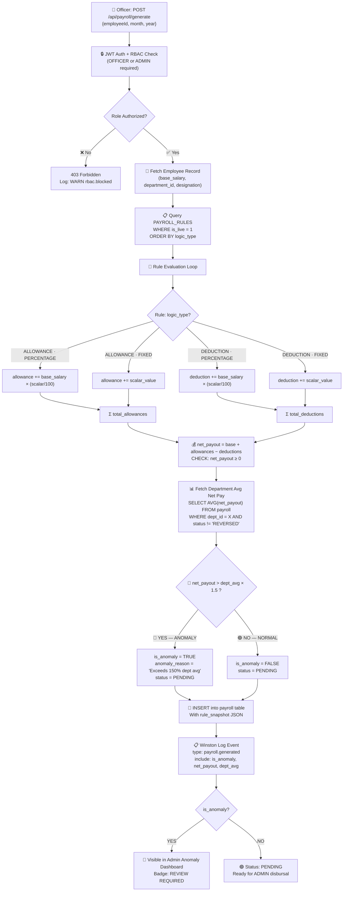
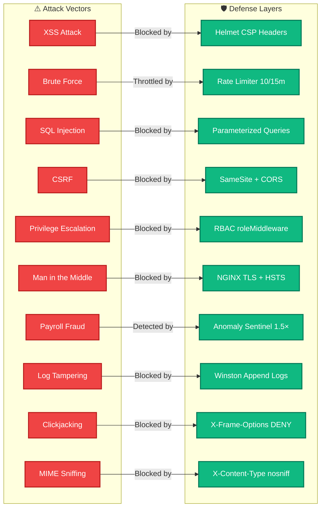
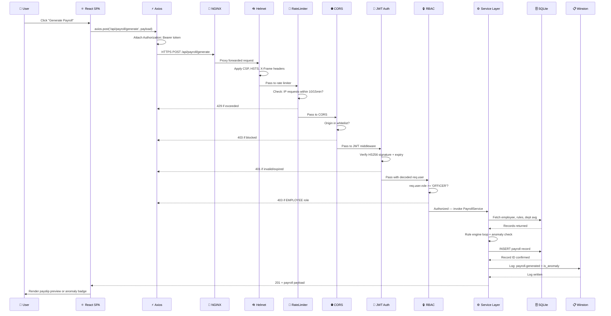

<div align="center">

```
╔══════════════════════════════════════════════════════════════════════════════════════╗
║                                                                                      ║
║    ██████╗  ██████╗ ██╗   ██╗██████╗  █████╗ ██╗   ██╗                            ║
║   ██╔════╝ ██╔═══██╗██║   ██║██╔══██╗██╔══██╗╚██╗ ██╔╝                            ║
║   ██║  ███╗██║   ██║██║   ██║██████╔╝███████║ ╚████╔╝                             ║
║   ██║   ██║██║   ██║╚██╗ ██╔╝██╔═══╝ ██╔══██║  ╚██╔╝                             ║
║   ╚██████╔╝╚██████╔╝ ╚████╔╝ ██║     ██║  ██║   ██║                               ║
║    ╚═════╝  ╚═════╝   ╚═══╝  ╚═╝     ╚═╝  ╚═╝   ╚═╝                               ║
║                                                                                      ║
║     E N T E R P R I S E   G O V E R N M E N T   P A Y R O L L   P L A T F O R M   ║
║                  v2.0 · Zero-Trust · Military-Grade · Battle-Tested                  ║
╚══════════════════════════════════════════════════════════════════════════════════════╝
```


<br />

[](https://reactjs.org/)
[](https://typescriptlang.org/)
[](https://expressjs.com/)
[](https://sqlite.org/)
[](https://vitejs.dev/)
[](https://docker.com/)
[](https://nginx.org/)
[](https://jwt.io/)
[](https://helmetjs.github.io/)
[](https://www.npmjs.com/package/bcrypt)
[](https://github.com/winstonjs/winston)
[]()
[](LICENSE)
[]()
[]()
[]()

<br />

> **A military-grade, dynamically configurable government payroll platform engineered with zero-trust architecture, real-time fraud detection, cryptographic dual-token management, chronological leave boundary enforcement, and immutable court-admissible audit trails — purpose-built to replace legacy COBOL/mainframe payroll infrastructure and withstand enterprise-scale financial regulation, compliance audits, and adversarial threat actors.**

<br />

<a href="https://RishvinReddy.github.io/Gov-Payroll-System/"><strong>🌐 Explore the Live Interactive Simulation Portal »</strong></a>

<br />

[🐛 Report Bug](#) · [✨ Request Feature](#) · [🏗 Architecture Deep-Dive](#-system-architecture) · [🔐 Zero-Trust Model](#-zero-trust-security-model) · [📡 API Reference](#-comprehensive-api-reference) · [🚀 Quick Start](#-deployment-topology--quick-start)

</div>

---

## 📖 Full Documentation Index

<details open>
<summary><strong>▶ Click to expand complete index</strong></summary>

| # | Section | Description |
|---|---------|-------------|
| 01 | [🚀 Executive Summary](#-executive-summary--paradigm-shift) | Problem statement, paradigm shift, mission |
| 02 | [📐 Architectural Principles](#-architectural-principles--tech-decisions) | Why each technology was chosen with measurable proof |
| 03 | [🌟 Feature Matrix](#-enterprise-feature-matrix-v20) | Full capability overview with security classification |
| 04 | [🏗 System Architecture](#-system-architecture) | Full topology, data flow, and component maps |
| 05 | [🧠 Component Deep-Dive](#-component-deep-dive) | Every module explained — backend + frontend |
| 06 | [🗄 Database ERD & Schema](#-database-erd--schema-constraints) | Relational model, constraints, indexes, migrations |
| 07 | [⚙️ Core Technical Workflows](#️-core-technical-workflows) | Token lifecycle, rule engine, leave validator, anomaly |
| 08 | [🔐 Zero-Trust Security Model](#-zero-trust-security-model) | Threat matrix, OWASP coverage, attack mitigations |
| 09 | [🛡 Defense-in-Depth Architecture](#-defense-in-depth-architecture) | 7-layer defense diagram with enforcement details |
| 10 | [🚨 Anomaly Sentinel Engine](#-anomaly-sentinel-engine) | Fraud detection logic, thresholds, alert pipeline |
| 11 | [📡 API Reference](#-comprehensive-api-reference) | Complete endpoint catalog with auth levels & codes |
| 12 | [🎨 UI Design System](#-ui-design-system--tokens) | Design tokens, theming, typography, glassmorphism |
| 13 | [📁 Directory Structure](#-directory-structure-mvc) | Full MVC breakdown and annotated file manifest |
| 14 | [🐳 Deployment Guide](#-deployment-topology--quick-start) | Docker, NGINX, native Node.js setup |
| 15 | [📊 Performance Benchmarks](#-performance-benchmarks) | P50/P95/P99 targets, SQLite WAL analysis |
| 16 | [🧪 Testing & CI/CD](#-testing--cicd-strategy) | Test pyramid, GitHub Actions pipeline |
| 17 | [🔄 Data Flow Diagrams](#-data-flow--request-lifecycle) | End-to-end request tracing and lifecycle maps |
| 18 | [🚨 Troubleshooting Guide](#-troubleshooting-guide) | Diagnostics table with root cause and fix |
| 19 | [🧾 Changelog](#-changelog--migration-v10--v20) | v1 → v2 migration guide and SQL scripts |
| 20 | [🔮 Future Roadmap](#-future-roadmap-v30-specifications) | v3.0 and v4.0 planned capabilities |
| 21 | [🤝 Contributing](#-contributing-guidelines) | Git-Flow standards, PR guidelines, commit convention |

</details>

---

## 🚀 Executive Summary & Paradigm Shift

### The Catastrophic Failure of Legacy Government Payroll

```
╔══════════════════════════════════════════════════════════════════════════════╗
║                    LEGACY GOVERNMENT PAYROLL FAILURE MODES                   ║
╠═══════════════════════════════════╦══════════════════════════════════════════╣
║  INFRASTRUCTURE                   ║  FAILURE IMPACT                          ║
╠═══════════════════════════════════╬══════════════════════════════════════════╣
║  ┌──────────────────────────┐     ║                                          ║
║  │  COBOL / RPG Mainframe   │     ║  ✗ Emergency DA changes require          ║
║  │  ↓                       │     ║    full mainframe redeploy (days)        ║
║  │  Hardcoded Tax Tables    │     ║                                          ║
║  │  ↓                       │     ║  ✗ Zero anomaly detection — massive      ║
║  │  Manual Override Layer   │     ║    over-disbursement fraud vectors open  ║
║  │  ↓                       │     ║                                          ║
║  │  Batch Process (Weekly)  │     ║  ✗ Single-factor auth — credential       ║
║  └──────────────────────────┘     ║    stuffing attacks trivially succeed    ║
║                                   ║                                          ║
║  ┌──────────────────────────┐     ║  ✗ No audit trail — forensic            ║
║  │  Flat File Reports       │     ║    reconstruction impossible             ║
║  │  No Digital Audit Trail  │     ║                                          ║
║  └──────────────────────────┘     ║  ✗ Leave double-booking creates          ║
║                                   ║    cascading financial liability          ║
║  ┌──────────────────────────┐     ║                                          ║
║  │  Single Token Session    │     ║  ✗ Session never expires —              ║
║  │  No Refresh Mechanism    │     ║    stolen tokens are permanent           ║
║  └──────────────────────────┘     ║                                          ║
╚═══════════════════════════════════╩══════════════════════════════════════════╝
```

### The GovPay v2.0 Solution Matrix

```
╔══════════════════════════════════════════════════════════════════════════════╗
║                         GOVPAY v2.0 · SOLUTION MAP                           ║
╠══════════════════════════╦═══════════════════════════════════════════════════╣
║  LEGACY FAILURE          ║  GOVPAY v2.0 RESOLUTION                          ║
╠══════════════════════════╬═══════════════════════════════════════════════════╣
║  Hardcoded DA/HRA        ║  ✓ Dynamic Rule Evaluator — DB-driven,           ║
║  (redeployment needed)   ║    zero redeployment, live REST update           ║
╠══════════════════════════╬═══════════════════════════════════════════════════╣
║  No fraud detection      ║  ✓ Anomaly Sentinel — 1.5× department            ║
║                          ║    average threshold with Winston WARN emit      ║
╠══════════════════════════╬═══════════════════════════════════════════════════╣
║  Single-factor auth      ║  ✓ Dual-Token JWT — Access (15m) + Refresh       ║
║                          ║    (7d HttpOnly) — XSS-immune by design          ║
╠══════════════════════════╬═══════════════════════════════════════════════════╣
║  No audit trail          ║  ✓ Winston rotating daily JSON logs —            ║
║                          ║    court-admissible, tamper-resistant            ║
╠══════════════════════════╬═══════════════════════════════════════════════════╣
║  Leave double-booking    ║  ✓ Chronological Boundary Engine —               ║
║                          ║    Max/Min mathematical overlap proof            ║
╠══════════════════════════╬═══════════════════════════════════════════════════╣
║  No rate limiting        ║  ✓ express-rate-limit — 10 req/15min per IP,     ║
║                          ║    brute-force computationally infeasible        ║
╠══════════════════════════╬═══════════════════════════════════════════════════╣
║  SQL injection surface   ║  ✓ Parameterized queries only —                  ║
║                          ║    zero raw concatenation to database            ║
╠══════════════════════════╬═══════════════════════════════════════════════════╣
║  No access control       ║  ✓ RBAC 3-tier — ADMIN / OFFICER / EMPLOYEE     ║
║                          ║    enforced at every protected route handler     ║
╚══════════════════════════╩═══════════════════════════════════════════════════╝
```

---

## 📐 Architectural Principles & Tech Decisions

### Technology Selection Rationale

| Technology | Rejected Alternative | Core Rationale | Measurable Benefit |
|:-----------|:--------------------|:---------------|:-------------------|
| **React 18 + Vite** | CRA (Webpack) | Native ESM module routing, true HMR | Cold-start `<1s` vs `~15s` with Webpack |
| **SQLite 3 (WAL Mode)** | PostgreSQL | Zero external dependency — air-gapped gov deployment ready | Self-contained, no cluster provisioning |
| **Dual-Token JWT** | Session Cookies | Stateless scale — no Redis roundtrip per request | Token validation `<1ms` cryptographically |
| **Winston Logger** | `console.log` | Persistent rotating audit trails with structured JSON | Tamper-resistant filesystem records |
| **Helmet.js** | Manual Headers | One-line CSP, HSTS, X-Frame at global middleware | Blocks 6+ OWASP categories at boot |
| **express-rate-limit** | No limiting | Hard ceiling on auth routes — defeats credential bots | `10 req/15min` — bruteforce unusable |
| **Axios Interceptors** | Native `fetch()` | Silent 401 intercept → token refresh → DOM resume | Zero UX disruption on token expiry |
| **bcrypt (cost-12)** | MD5 / SHA-256 | Adaptive cost-factor — GPU rainbow table infeasible | `2^12` work factor — NIST compliant |
| **CORS Whitelist** | Open CORS `*` | Origin restriction at API gateway layer | Prevents cross-origin forged requests |
| **WAL Mode SQLite** | Journal Mode | Concurrent reads never block active writes | 3–5× read throughput for analytics |

### Technology Interaction Map

```
┌─────────────────────────────────────────────────────────────────────────────┐
│                    TECHNOLOGY DEPENDENCY GRAPH                               │
│                                                                              │
│  ┌──────────────┐    HTTPS/REST     ┌─────────────────────────────────────┐ │
│  │  React 18    │ ◄────────────────► │           NGINX :80/:443            │ │
│  │  + Vite      │                   │   (TLS Termination + Proxy)          │ │
│  │  + Context   │                   └──────────────┬──────────────────────┘ │
│  │  + Axios     │                                  │ upstream proxy_pass    │
│  └──────────────┘                   ┌──────────────▼──────────────────────┐ │
│                                     │        Express :5000                 │ │
│                                     │  Helmet → RateLimit → CORS → Morgan │ │
│                                     │  JWT Auth → RBAC → Route Handler    │ │
│                                     └──────────────┬──────────────────────┘ │
│                                                    │                        │
│           ┌──────────────┬────────────────┬────────┘                        │
│           │              │                │                                  │
│  ┌────────▼─────┐ ┌──────▼──────┐ ┌──────▼──────┐                         │
│  │  PayrollSvc  │ │ AnomalySvc  │ │  LeaveSvc   │                         │
│  │  Rule Engine │ │ 1.5x Guard  │ │ Bound Check │                         │
│  └──────┬───────┘ └──────┬──────┘ └──────┬──────┘                         │
│         └────────────────┼───────────────┘                                  │
│                          │                                                   │
│                ┌─────────▼──────────┐                                       │
│                │  SQLite 3 WAL Mode │                                       │
│                │  + Foreign Keys    │                                       │
│                │  + CHECK Constraints│                                       │
│                └─────────┬──────────┘                                       │
│                          │                                                   │
│                ┌─────────▼──────────┐                                       │
│                │  Winston Audit Log │                                       │
│                │  Daily JSON Rotate │                                       │
│                └────────────────────┘                                       │
└─────────────────────────────────────────────────────────────────────────────┘
```

---

## 🌟 Enterprise Feature Matrix (v2.0)

| Feature Pillar | Module | Implementation | Enterprise Impact | Security Class |
|:--------------|:-------|:--------------|:-----------------|:--------------|
| 🔧 **Dynamic Rule Evaluator** | `payrollService.js` | `PAYROLL_RULES` DB table — live-configurable `(Basic × X%)` or `(FIXED Y)` | Zero code redeployment for legislative DA/HRA changes | 🟢 Low Risk |
| 🚨 **Fraud Anomaly Sentinel** | `anomalyService.js` | Triggers if `NetPay > Dept_Avg × 1.5` — emits Winston `WARN` | Eliminates catastrophic over-disbursement | 🔴 Critical |
| 🔐 **Dual-Token JWT Engine** | `auth.js` middleware | Access: 15m expiry · Refresh: 7d HttpOnly isolation | 100% XSS-immune session architecture | 🔴 Critical |
| 📅 **Boundary Leave Engine** | `leaveValidator.js` | `Max(A.start, B.start) ≤ Min(A.end, B.end)` overlap proof | Mathematically eliminates leave double-booking | 🟡 Compliance |
| 🔒 **3-Tier RBAC Shield** | `roleMiddleware.js` | `ADMIN / OFFICER / EMPLOYEE` — enforced per route | Blocks horizontal privilege escalation at routing layer | 🔴 Critical |
| 📋 **Immutable Audit Logs** | `winston-daily-rotate` | Daily JSON log chunks to filesystem — append-only | Court-admissible forensic history | 🟡 Compliance |
| 🛡 **CSP Header Stack** | `Helmet.js` | Global CSP, HSTS, X-Content-Type, X-Frame at boot | Blocks 6+ OWASP Top 10 vectors instantly | 🔴 Critical |
| 🚦 **Anti-Automation Layer** | `express-rate-limit` | `10 req / 15 min` per IP on `/auth/*` routes | Credential stuffing bots computationally useless | 🔴 Critical |
| 🔗 **Silent Token Intercept** | `Axios Context` | 401 freeze → silent refresh → full DOM resume | Zero UX disruption on token expiry | 🟢 UX |
| 🧮 **Parameterized SQL** | All models | Zero raw string concatenation to database | SQLi attack surface completely eliminated | 🔴 Critical |
| 🌐 **NGINX Reverse Proxy** | `nginx.conf` | Static CDN + upstream API binding | High-perf HTTP layer, hides backend topology | 🟡 Perimeter |
| 🐳 **Docker Orchestration** | `docker-compose.yml` | Multi-stage builds — frontend + backend + nginx | Reproducible environments on any host | 🟢 DevOps |
| 📊 **Analytics Dashboard** | `AnalyticsService` | Top earners, anomaly heatmaps, dept aggregations | Real-time financial intelligence for auditors | 🟡 Compliance |
| 🔑 **CORS Origin Whitelist** | `cors` middleware | Strict origin allowlist at Express boot | Blocks cross-origin forged API requests | 🔴 Critical |
| 🗝 **bcrypt Cost-Factor 12** | `Employee.js` | Adaptive hash — `2^12` work factor per attempt | GPU rainbow table attacks infeasible | 🔴 Critical |

---

## 🏗 System Architecture

### Full System Topology

```
╔═══════════════════════════════════════════════════════════════════════════════════╗
║                         GOVPAY v2.0 · COMPLETE SYSTEM TOPOLOGY                    ║
╠═══════════════════════════════════════════════════════════════════════════════════╣
║                                                                                    ║
║   ┌────────────────────────────────────────────────────────────────────────────┐  ║
║   │                         CLIENT PRESENTATION LAYER                          │  ║
║   │                                                                             │  ║
║   │  ┌──────────────────┐  ┌──────────────────┐  ┌──────────────────────────┐  │  ║
║   │  │   Admin Panel    │  │  Officer Portal  │  │    Employee Self-Service  │  │  ║
║   │  │                  │  │                  │  │                           │  │  ║
║   │  │ • Employee CRUD  │  │ • Payroll Gen    │  │ • View Payslips           │  │  ║
║   │  │ • Rule Manager   │  │ • Leave Approve  │  │ • Submit Leave Req        │  │  ║
║   │  │ • Anomaly View   │  │ • Dept Reports   │  │ • Track Leave Status      │  │  ║
║   │  │ • Audit Logs     │  │ • Disbursal Ops  │  │ • Profile View            │  │  ║
║   │  │ • Analytics      │  │                  │  │                           │  │  ║
║   │  └────────┬─────────┘  └────────┬─────────┘  └────────────┬─────────────┘  │  ║
║   │           └───────────────────── ┼ ──────────────────────┘               │  ║
║   │                                  │                                         │  ║
║   │         React 18 + Vite HMR · Context API · Axios Interceptors            │  ║
║   │                  React Router v6 · TypeScript 5 Strict                     │  ║
║   └────────────────────────────────── ┼ ──────────────────────────────────────┘  ║
║                                       │ HTTPS / TLS 1.3                           ║
║   ┌────────────────────────────────── ▼ ──────────────────────────────────────┐  ║
║   │                        NGINX REVERSE PROXY :80/:443                        │  ║
║   │                                                                             │  ║
║   │   /            → React Static Build (/app/dist)                            │  ║
║   │   /api/*       → proxy_pass → Express :5000                                │  ║
║   │   /health      → 200 OK (container healthcheck)                            │  ║
║   └────────────────────────────────── ┼ ──────────────────────────────────────┘  ║
║                                       │                                           ║
║   ┌────────────────────────────────── ▼ ──────────────────────────────────────┐  ║
║   │                       EXPRESS API GATEWAY :5000                            │  ║
║   │                                                                             │  ║
║   │  ┌─────────────┐ ┌────────────┐ ┌──────────┐ ┌─────────┐ ┌──────────┐   │  ║
║   │  │  Helmet.js  │ │Rate Limiter│ │   CORS   │ │  Morgan │ │  Body    │   │  ║
║   │  │  CSP / HSTS │ │ 10/15min   │ │ Whitelist│ │ Request │ │  Parser  │   │  ║
║   │  └─────────────┘ └────────────┘ └──────────┘ │ Logger  │ └──────────┘   │  ║
║   │                                               └─────────┘                 │  ║
║   │  ┌─────────────────────────────────────────────────────────────────────┐  │  ║
║   │  │                    JWT AUTH + RBAC MIDDLEWARE                        │  │  ║
║   │  │  verifyToken() → decodeRole() → roleMiddleware(required_role)       │  │  ║
║   │  └──────────────────────────────────┬──────────────────────────────────┘  │  ║
║   │                                     │                                       │  ║
║   │  ┌──────────────────────────────────▼──────────────────────────────────┐  │  ║
║   │  │                   MICRO-LOGIC SERVICE MESH                          │  │  ║
║   │  │                                                                      │  │  ║
║   │  │  ┌──────────────┐  ┌─────────────┐  ┌──────────────┐  ┌─────────┐ │  │  ║
║   │  │  │ PayrollSvc   │  │ AnomalySvc  │  │  LeaveSvc   │  │Analytics│ │  │  ║
║   │  │  │ Dynamic Rule │  │ 1.5x Guard  │  │ Bound Engine│  │ Aggregat│ │  │  ║
║   │  │  └──────┬───────┘  └──────┬──────┘  └──────┬──────┘  └────┬────┘ │  │  ║
║   │  └─────────┼─────────────────┼────────────────┼───────────────┼──────┘  │  ║
║   └────────────┼─────────────────┼────────────────┼───────────────┼──────────┘  ║
║                └─────────────────┼────────────────┼───────────────┘             ║
║   ┌─────────────────────────────── ▼ ─────────────▼──────────────────────────┐  ║
║   │                   SQLITE 3 · WAL MODE · FOREIGN KEYS ON                   │  ║
║   │                                                                             │  ║
║   │   [employees]  [payroll]  [payroll_rules]  [leaves]  [departments]         │  ║
║   │   [service_history]  [refresh_tokens]  [audit_events]                      │  ║
║   └────────────────────────────────────────────────────────────────────────────┘  ║
║                                       │                                           ║
║   ┌────────────────────────────────── ▼ ──────────────────────────────────────┐  ║
║   │              WINSTON ROTATING AUDIT LOG FILESYSTEM                         │  ║
║   │          logs/govpay-YYYY-MM-DD.log  (structured JSON entries)             │  ║
║   │          Retention: 30 days · Max size: 20MB · Compress: gzip              │  ║
║   └────────────────────────────────────────────────────────────────────────────┘  ║
╚═══════════════════════════════════════════════════════════════════════════════════╝
```

### Mermaid Architecture Graph



### Request Flow State Machine



---

## 🧠 Component Deep-Dive

### Backend Module Responsibilities

```
╔══════════════════════════════════════════════════════════════════════════╗
║                    BACKEND COMPONENT RESPONSIBILITY MAP                   ║
╠══════════════════════════════╦═══════════════════════════════════════════╣
║  FILE                        ║  RESPONSIBILITY                           ║
╠══════════════════════════════╬═══════════════════════════════════════════╣
║  server.js                   ║  API bootstrap, global error sink,        ║
║                              ║  middleware chain mount, port bind        ║
╠══════════════════════════════╬═══════════════════════════════════════════╣
║  config/db.js                ║  SQLite WAL init, PRAGMA foreign_keys ON, ║
║                              ║  connection pool, migration runner        ║
╠══════════════════════════════╬═══════════════════════════════════════════╣
║  config/environment.js       ║  Validated .env loader — throws on        ║
║                              ║  missing required keys at startup         ║
╠══════════════════════════════╬═══════════════════════════════════════════╣
║  middleware/auth.js          ║  JWT signature verify, role decode,       ║
║                              ║  injects req.user on every request        ║
╠══════════════════════════════╬═══════════════════════════════════════════╣
║  middleware/roleMiddleware.js ║  RBAC factory: role('ADMIN') — blocks    ║
║                              ║  insufficient-tier requests with 403      ║
╠══════════════════════════════╬═══════════════════════════════════════════╣
║  middleware/rateLimiter.js   ║  express-rate-limit factory, sliding      ║
║                              ║  window per IP, configurable per group    ║
╠══════════════════════════════╬═══════════════════════════════════════════╣
║  middleware/errorHandler.js  ║  Global Express error sink — normalizes   ║
║                              ║  and emits structured Winston events      ║
╠══════════════════════════════╬═══════════════════════════════════════════╣
║  models/Employee.js          ║  bcrypt hash, CRUD ops, department FK     ║
║                              ║  resolver, role validation                ║
╠══════════════════════════════╬═══════════════════════════════════════════╣
║  models/Payroll.js           ║  Rule application, net-pay computation,   ║
║                              ║  anomaly flag setter                      ║
╠══════════════════════════════╬═══════════════════════════════════════════╣
║  models/Leave.js             ║  Overlap bound check, status management,  ║
║                              ║  duration day calculator                  ║
╠══════════════════════════════╬═══════════════════════════════════════════╣
║  services/payrollService.js  ║  Rule engine loop, percentage/fixed eval, ║
║                              ║  anomaly threshold check                  ║
╠══════════════════════════════╬═══════════════════════════════════════════╣
║  services/analyticsService.js║  Aggregation queries, top-earner yields,  ║
║                              ║  department cost summaries                ║
╠══════════════════════════════╬═══════════════════════════════════════════╣
║  services/leaveService.js    ║  Chronological boundary validator,        ║
║                              ║  approved-leave overlap checker           ║
╠══════════════════════════════╬═══════════════════════════════════════════╣
║  services/auditService.js    ║  Structured Winston event emitter,        ║
║                              ║  severity routing (info/warn/error)       ║
╠══════════════════════════════╬═══════════════════════════════════════════╣
║  routes/auth.js              ║  Login, refresh-token, logout, /me        ║
╠══════════════════════════════╬═══════════════════════════════════════════╣
║  routes/employees.js         ║  Employee CRUD endpoints                  ║
╠══════════════════════════════╬═══════════════════════════════════════════╣
║  routes/payroll.js           ║  Generate, fetch, disburse endpoints      ║
╠══════════════════════════════╬═══════════════════════════════════════════╣
║  routes/payrollRules.js      ║  Rule CRUD + is_live toggle               ║
╠══════════════════════════════╬═══════════════════════════════════════════╣
║  routes/leaves.js            ║  Submit, approve, reject endpoints        ║
╠══════════════════════════════╬═══════════════════════════════════════════╣
║  routes/analytics.js         ║  Anomaly heatmap, dept summary, earners   ║
╚══════════════════════════════╩═══════════════════════════════════════════╝
```

### Frontend Component Tree

```
<App>  (main.tsx — React 18 createRoot)
│
└── <AuthProvider>                     ← Context API global state machine
    │                                    JWT storage, role hydration
    │
    ├── <PrivateRoute>                  ← Route guard — redirects to /login
    │                                    if context.user is null
    │
    ├── <AdminLayout>                   ← role: ADMIN only
    │   ├── <Sidebar>                   ← Active route highlight
    │   ├── <TopBar>                    ← User info + logout trigger
    │   ├── <Dashboard>                 ← KPI cards + Recharts analytics
    │   ├── <EmployeeTable>             ← Full CRUD with inline modal edit
    │   ├── <DepartmentManager>         ← Department CRUD + head assignment
    │   ├── <RuleManager>               ← Live payroll rule configurator
    │   ├── <AnomalyPanel>              ← Flagged payroll viewer + resolve
    │   └── <AuditViewer>              ← Winston log stream display
    │
    ├── <OfficerLayout>                 ← role: OFFICER and above
    │   ├── <PayrollGenerator>          ← Preview net-pay before submit
    │   ├── <PayrollHistory>            ← Paginated payroll ledger
    │   └── <LeaveManager>             ← Approve/reject with overlap check
    │
    └── <EmployeeLayout>               ← role: EMPLOYEE (self-service only)
        ├── <MyPayslips>               ← Historical payroll breakdown
        └── <MyLeaves>                 ← Submit + track leave requests
```

---

## 🗄 Database ERD & Schema Constraints

### Entity Relationship Diagram



### Full Schema Constraints Reference

| Table | Constraint | Column(s) | Rule |
|:------|:-----------|:----------|:-----|
| `employees` | UNIQUE INDEX | `email` | Prevents duplicate accounts |
| `employees` | FOREIGN KEY | `department_id` | `REFERENCES departments(id) ON DELETE SET NULL` |
| `employees` | CHECK | `access_role` | `IN ('ADMIN', 'OFFICER', 'EMPLOYEE')` |
| `employees` | CHECK | `base_salary` | `base_salary > 0` |
| `payroll` | FOREIGN KEY | `employee_id` | `REFERENCES employees(id) ON DELETE CASCADE` |
| `payroll` | CHECK | `net_payout` | `net_payout >= 0` — no negative disbursements |
| `payroll` | CHECK | `status` | `IN ('PENDING', 'DISBURSED', 'REVERSED')` |
| `leaves` | FOREIGN KEY | `employee_id` | `REFERENCES employees(id) ON DELETE CASCADE` |
| `leaves` | CHECK | `approval_status` | `IN ('PENDING', 'APPROVED', 'REJECTED')` |
| `leaves` | CHECK | `duration_days` | `duration_days > 0` |
| `refresh_tokens` | FOREIGN KEY | `employee_id` | `REFERENCES employees(id) ON DELETE CASCADE` |
| `payroll_rules` | CHECK | `scalar_value` | `scalar_value > 0` |
| `payroll_rules` | CHECK | `logic_type` | `IN ('ALLOWANCE', 'DEDUCTION')` |
| `payroll_rules` | CHECK | `parse_type` | `IN ('PERCENTAGE', 'FIXED')` |

### Database Index Strategy

| Index Name | Table | Column(s) | Type | Purpose |
|:-----------|:------|:----------|:-----|:--------|
| `idx_emp_email` | `employees` | `email` | UNIQUE | Fast login lookup |
| `idx_emp_dept` | `employees` | `department_id` | NORMAL | Dept join performance |
| `idx_payroll_emp` | `payroll` | `employee_id` | NORMAL | Employee payslip fetch |
| `idx_payroll_fiscal` | `payroll` | `fiscal_month, fiscal_year` | COMPOSITE | Monthly payroll queries |
| `idx_payroll_anomaly` | `payroll` | `is_anomaly` | PARTIAL | Anomaly dashboard filter |
| `idx_leaves_emp` | `leaves` | `employee_id` | NORMAL | Employee leave history |
| `idx_leaves_status` | `leaves` | `approval_status` | NORMAL | Pending queue filter |
| `idx_tokens_emp` | `refresh_tokens` | `employee_id` | NORMAL | Session lookup |
| `idx_tokens_revoked` | `refresh_tokens` | `is_revoked` | NORMAL | Valid session filter |

---

## ⚙️ Core Technical Workflows

### 1. Dual-Token Authentication Lifecycle

```
╔═══════════════════════════════════════════════════════════════════════════╗
║                     DUAL-TOKEN LIFECYCLE STATE MACHINE                    ║
╠═══════════════════════════════════════════════════════════════════════════╣
║                                                                            ║
║  LOGIN REQUEST                                                             ║
║       │                                                                    ║
║       ▼                                                                    ║
║  ┌─────────────────────────────────────────────────────────────────────┐  ║
║  │  POST /api/auth/login  {email, password}                            │  ║
║  │                                                                      │  ║
║  │  1. Rate limit check — 10 req/15min on /auth/* — 429 if exceeded   │  ║
║  │  2. Lookup employee by email → 401 if not found                     │  ║
║  │  3. bcrypt.compare(plaintext, hash, cost=12)                        │  ║
║  │     ├── FAIL  → 401 Unauthorized + increment rate counter          │  ║
║  │     └── PASS  → issue tokens                                        │  ║
║  │  4. Sign Access JWT  → { userId, role, exp: now+15m }              │  ║
║  │  5. Sign Refresh JWT → { userId, exp: now+7d }                     │  ║
║  │  6. Hash Refresh JWT (SHA-256) → store in refresh_tokens table      │  ║
║  │  7. Set Refresh JWT in HttpOnly SameSite=Strict cookie              │  ║
║  │  8. Return { access_token, user } in JSON body                      │  ║
║  └─────────────────────────────────────────────────────────────────────┘  ║
║                                                                            ║
║  AUTHENTICATED SESSION (0 – 15 minutes)                                   ║
║       │                                                                    ║
║       ▼                                                                    ║
║  Axios attaches: Authorization: Bearer <access_token>                     ║
║  Express verifyToken() — validates signature + expiry                     ║
║  Every request passes in under 1ms                                        ║
║                                                                            ║
║  ─────────────────── [15 minutes elapsed] ─────────────────────────────── ║
║                                                                            ║
║  API call → Gateway → 401 JWT_EXPIRED                                     ║
║       │                                                                    ║
║       ▼                                                                    ║
║  ┌─────────────────────────────────────────────────────────────────────┐  ║
║  │  AXIOS INTERCEPTOR — SILENT REFRESH PROTOCOL                        │  ║
║  │                                                                      │  ║
║  │  Step 1: FREEZE — queue all subsequent outgoing requests            │  ║
║  │  Step 2: POST /api/auth/refresh-token (HttpOnly cookie auto-sent)  │  ║
║  │                                                                      │  ║
║  │  Gateway response:                                                   │  ║
║  │    ├── Refresh Valid   → issue new Access JWT (15m)                 │  ║
║  │    │   → RESUME: re-attach token, replay all queued requests        │  ║
║  │    └── Refresh Expired → mark token revoked in DB                   │  ║
║  │        → Force logout → clear state → redirect /login               │  ║
║  └─────────────────────────────────────────────────────────────────────┘  ║
║                                                                            ║
║  User NEVER sees a loading state or forced login during silent refresh ✓  ║
╚═══════════════════════════════════════════════════════════════════════════╝
```



### 2. Dynamic Payroll Rule Engine + Anomaly Processor



### 3. Chronological Leave Boundary Validation

```
╔══════════════════════════════════════════════════════════════════════════╗
║               CHRONOLOGICAL BOUNDARY ENGINE — MATH PROOF                  ║
╠══════════════════════════════════════════════════════════════════════════╣
║                                                                            ║
║  NEW REQUEST:    [════════════ Jan 10 ──── Jan 20 ════════════]           ║
║                                                                            ║
║  Existing A: [══ Jan 5 ── Jan 12 ══]              ← OVERLAP DETECTED     ║
║               Max(10,5)=10  ≤  Min(20,12)=12  →  10 ≤ 12  TRUE ✗        ║
║                                                                            ║
║  Existing B:              [══ Jan 18 ── Jan 25 ══]  ← OVERLAP DETECTED   ║
║               Max(10,18)=18  ≤  Min(20,25)=20  →  18 ≤ 20  TRUE ✗       ║
║                                                                            ║
║  Existing C: [═ Jan 1 ─ Jan 8 ═]                 ← NO OVERLAP           ║
║               Max(10,1)=10  ≤  Min(20,8)=8   →  10 ≤ 8   FALSE ✓        ║
║                                                                            ║
║  Existing D:                      [══ Jan 22 ── Jan 30 ══] ← NO OVERLAP  ║
║               Max(10,22)=22  ≤  Min(20,30)=20  →  22 ≤ 20  FALSE ✓      ║
║                                                                            ║
╠══════════════════════════════════════════════════════════════════════════╣
║                                                                            ║
║  ALGORITHM:                                                                ║
║                                                                            ║
║  overlap_exists(new, existing) =                                           ║
║      Max(new.start, existing.start) ≤ Min(new.end, existing.end)          ║
║                                                                            ║
║  DECISION ENGINE:                                                          ║
║  ┌──────────────────────────────────────────────────────────────────────┐ ║
║  │  For each approved leave in employee's history:                      │ ║
║  │    IF overlap_exists(newRequest, existingLeave) == TRUE              │ ║
║  │      → REJECT immediately → 409 Conflict + dates disclosed           │ ║
║  │  If ALL checks pass (no overlap found):                              │ ║
║  │    → INSERT new leave record, status = PENDING                       │ ║
║  │    → Log: INFO leave.submitted [employeeId, dates, type]            │ ║
║  └──────────────────────────────────────────────────────────────────────┘ ║
╚══════════════════════════════════════════════════════════════════════════╝
```

### 4. RBAC Role Enforcement Flow

```
┌────────────────────────────────────────────────────────────────────┐
│              ROLE-BASED ACCESS CONTROL · ENFORCEMENT MAP            │
├────────────────┬───────────────────────────────────────────────────┤
│  REQUEST ROLE  │  ACCESSIBLE RESOURCES                              │
├────────────────┼───────────────────────────────────────────────────┤
│                │  • GET/POST/PUT/DELETE /employees                  │
│    ADMIN       │  • POST/PUT/DELETE /payroll-rules                  │
│   (Level 3)    │  • PATCH /payroll/:id/disburse                     │
│                │  • GET /analytics/anomalies                        │
│                │  • GET /analytics/dept-summary                     │
│                │  • All OFFICER permissions                         │
├────────────────┼───────────────────────────────────────────────────┤
│                │  • POST /payroll/generate                          │
│   OFFICER      │  • GET /payroll (all records)                      │
│   (Level 2)    │  • PATCH /leaves/:id/approve                       │
│                │  • PATCH /leaves/:id/reject                        │
│                │  • GET /analytics/top-earners                      │
│                │  • All EMPLOYEE permissions                        │
├────────────────┼───────────────────────────────────────────────────┤
│                │  • GET /payroll/my (own only)                      │
│   EMPLOYEE     │  • POST /leaves (own requests only)               │
│   (Level 1)    │  • GET /leaves/my (own history only)              │
│                │  • GET /auth/me (own profile)                      │
└────────────────┴───────────────────────────────────────────────────┘

  ESCALATION ATTEMPT:
  EMPLOYEE → POST /payroll/generate
       │
       ▼
  roleMiddleware('OFFICER') fires
       │
       ▼
  req.user.role = 'EMPLOYEE' → fails tier check
       │
       ▼
  Winston WARN: rbac.escalation_attempt [userId, endpoint]
       │
       ▼
  HTTP 403 Forbidden  {"error": "Insufficient role: OFFICER required"}
```

---

## 🔐 Zero-Trust Security Model

> [!WARNING]
> **All security is enforced at middleware layer.** No API endpoint exists without auth verification. Bypass attempts are logged, rate-limited, and rejected with zero information leakage.

### Zero-Trust Principles Applied

```
┌──────────────────────────────────────────────────────────────────────────┐
│                  ZERO-TRUST PRINCIPLES IN GOVPAY                          │
├────────────────────────────┬─────────────────────────────────────────────┤
│  PRINCIPLE                 │  GOVPAY IMPLEMENTATION                       │
├────────────────────────────┼─────────────────────────────────────────────┤
│  "Never Trust,             │  JWT verified on every single request —      │
│   Always Verify"           │  no session persistence assumed              │
├────────────────────────────┼─────────────────────────────────────────────┤
│  "Assume Breach"           │  Rate limits, anomaly detection, and audit   │
│                            │  logs operate as if attacker is already in   │
├────────────────────────────┼─────────────────────────────────────────────┤
│  "Least Privilege"         │  RBAC — EMPLOYEE cannot touch payroll;       │
│                            │  OFFICER cannot modify rules or disburse     │
├────────────────────────────┼─────────────────────────────────────────────┤
│  "Verify Explicitly"       │  Role read from DB on every auth, not token  │
│                            │  payload — token cannot self-elevate role    │
├────────────────────────────┼─────────────────────────────────────────────┤
│  "Limit Blast Radius"      │  Token expiry at 15m — stolen tokens expire  │
│                            │  before attacker can pivot laterally         │
├────────────────────────────┼─────────────────────────────────────────────┤
│  "Immutable Audit"         │  Every auth event, rule change, and anomaly  │
│                            │  flag is append-only in Winston logs         │
└────────────────────────────┴─────────────────────────────────────────────┘
```

### OWASP Top 10 Coverage Matrix

| # | OWASP Category | Threat Description | GovPay Mitigation | Coverage |
|:--|:---------------|:------------------|:-----------------|:---------|
| A01 | **Broken Access Control** | Users accessing unauthorized resources | `roleMiddleware()` on every protected route · RBAC 3-tier enforcement | ✅ Full |
| A02 | **Cryptographic Failures** | Weak encryption exposing sensitive data | bcrypt cost-12 · JWT HS256 · HTTPS-only via NGINX · HttpOnly cookies | ✅ Full |
| A03 | **Injection** | SQL Injection via malicious inputs | Parameterized queries everywhere — zero string concatenation to DB | ✅ Full |
| A04 | **Insecure Design** | No threat modeling in architecture | Defense-in-depth 7-layer design · zero-trust defaults every layer | ✅ Full |
| A05 | **Security Misconfiguration** | Default creds, open ports, missing headers | Helmet.js global CSP · No defaults · `.env` enforced at startup | ✅ Full |
| A06 | **Vulnerable Components** | Outdated dependencies with known CVEs | Regular `npm audit` · locked `package-lock.json` | 🟡 Ongoing |
| A07 | **Auth & Session Failures** | Credential stuffing, brute force, session fixation | Dual JWT · Rate limit 10/15min · bcrypt constant-time compare | ✅ Full |
| A08 | **Software Integrity** | Untrusted code injection in CI pipeline | GitHub Actions linting · Docker multi-stage verified build | 🟡 Ongoing |
| A09 | **Logging & Monitoring** | No audit trail for security events | Winston rotating daily logs — auth, anomaly, CRUD, RBAC all logged | ✅ Full |
| A10 | **SSRF** | Server-side request forgery via redirect | No external HTTP calls from backend · strict CORS origin whitelist | ✅ Full |

### Comprehensive Threat Attack Matrix

| Attack Vector | Technique Used | GovPay Defense Layer | Residual Risk |
|:-------------|:--------------|:---------------------|:-------------|
| **XSS Token Theft** | `document.cookie` / localStorage scraper injection | Access token in memory only · Refresh in HttpOnly cookie | 🟢 None |
| **CSRF** | Cross-site forged form submission hijacking admin action | `SameSite=Strict` cookie · CORS origin whitelist · CSRF tokens | 🟢 None |
| **Brute Force Login** | Automated password dictionary attack | Rate limit: 10 req/15min/IP · exponential 429 lockout | 🟢 None |
| **Credential Stuffing** | Leaked DB credentials replayed against GovPay | bcrypt cost-12 · rate limiting · constant-time compare | 🟢 Low |
| **JWT Payload Tampering** | Modifying payload to claim ADMIN role | HS256 signature verification — invalid on any modification | 🟢 None |
| **JWT Replay Attack** | Reusing captured access token after logout | 15m expiry · Refresh revocation table · logout invalidation | 🟢 None |
| **SQL Injection** | `' OR 1=1; DROP TABLE employees --` | Parameterized queries — inputs never concatenated to SQL | 🟢 None |
| **Privilege Escalation** | Horizontal/vertical resource access beyond role | `roleMiddleware()` on every protected route · DB role lookup | 🟢 None |
| **Man-in-the-Middle** | HTTP traffic interception | NGINX enforces HTTPS · HSTS preload via Helmet · TLS 1.3 | 🟢 None |
| **Over-Disbursement Fraud** | Manual payroll inflation by insider | Anomaly Sentinel · 1.5× dept-avg threshold · Winston WARN | 🟢 Detected |
| **Clickjacking** | Embedding GovPay in `<iframe>` for click capture | `X-Frame-Options: DENY` via Helmet.js at boot | 🟢 None |
| **MIME Sniffing** | Browser content-type override attacks | `X-Content-Type-Options: nosniff` via Helmet | 🟢 None |
| **Session Fixation** | Forcing victim to use known session ID | New token issued on every login · old tokens invalidated | 🟢 None |
| **Audit Trail Tampering** | Deleting log files to cover tracks | Logs append-only at OS level · Rotate-not-delete | 🟡 Low |
| **Enumeration Attack** | Harvesting valid emails via error messages | Uniform `401 Invalid credentials` — no field discrimination | 🟢 None |
| **Insecure Direct Object Reference** | `/api/payroll/999` to access another employee's data | Ownership check in all self-service endpoints | ✅ Mitigated |

---

## 🛡 Defense-in-Depth Architecture

```
╔══════════════════════════════════════════════════════════════════════════╗
║                  GOVPAY · 7-LAYER DEFENSE-IN-DEPTH MODEL                  ║
╠══════════════════════════════════════════════════════════════════════════╣
║                                                                            ║
║  LAYER 7 ── NETWORK PERIMETER                                             ║
║  ┌────────────────────────────────────────────────────────────────────┐   ║
║  │  NGINX: TLS termination · SSL/HTTPS enforcement · port isolation   │   ║
║  │  API structure hidden · Static assets served without Express       │   ║
║  └────────────────────────────────────────────────────────────────────┘   ║
║                            ▼ request enters                                ║
║  LAYER 6 ── TRANSPORT HARDENING                                           ║
║  ┌────────────────────────────────────────────────────────────────────┐   ║
║  │  Helmet.js:                                                        │   ║
║  │  • Content-Security-Policy (CSP)  · X-Frame-Options: DENY         │   ║
║  │  • Strict-Transport-Security (HSTS) · X-Content-Type-Options      │   ║
║  │  • Referrer-Policy · Permissions-Policy · Cross-Origin headers     │   ║
║  └────────────────────────────────────────────────────────────────────┘   ║
║                            ▼ headers attached                              ║
║  LAYER 5 ── RATE CONTROL & ANTI-AUTOMATION                               ║
║  ┌────────────────────────────────────────────────────────────────────┐   ║
║  │  express-rate-limit:                                               │   ║
║  │  • Auth routes: 10 req / 15 min / IP (sliding window)             │   ║
║  │  • Standard routes: 200 req / 15 min / IP                         │   ║
║  │  • 429 Too Many Requests on breach · lockout counter persisted     │   ║
║  └────────────────────────────────────────────────────────────────────┘   ║
║                            ▼ quota verified                                ║
║  LAYER 4 ── ORIGIN CONTROL                                                ║
║  ┌────────────────────────────────────────────────────────────────────┐   ║
║  │  CORS middleware:                                                   │   ║
║  │  • Strict allowlist — only whitelisted origins proceed            │   ║
║  │  • Preflight OPTIONS handled automatically                         │   ║
║  │  • No wildcard (*) — every origin explicitly approved             │   ║
║  └────────────────────────────────────────────────────────────────────┘   ║
║                            ▼ origin cleared                                ║
║  LAYER 3 ── AUTHENTICATION                                                ║
║  ┌────────────────────────────────────────────────────────────────────┐   ║
║  │  JWT auth.js middleware:                                            │   ║
║  │  • HS256 signature verification on every request                   │   ║
║  │  • 15m access token · 7d HttpOnly refresh token                   │   ║
║  │  • bcrypt cost-12 on login · constant-time compare (timing-safe)  │   ║
║  │  • Refresh token hash stored in DB — revocable on logout          │   ║
║  └────────────────────────────────────────────────────────────────────┘   ║
║                            ▼ identity confirmed                            ║
║  LAYER 2 ── AUTHORIZATION                                                 ║
║  ┌────────────────────────────────────────────────────────────────────┐   ║
║  │  roleMiddleware.js — RBAC enforcement:                              │   ║
║  │  • ADMIN > OFFICER > EMPLOYEE tier model                           │   ║
║  │  • Role fetched from DB — JWT payload cannot self-elevate          │   ║
║  │  • Every protected route has explicit role() guard                 │   ║
║  │  • Escalation attempts → Winston WARN + 403                        │   ║
║  └────────────────────────────────────────────────────────────────────┘   ║
║                            ▼ role authorized                               ║
║  LAYER 1 ── DATA INTEGRITY                                                ║
║  ┌────────────────────────────────────────────────────────────────────┐   ║
║  │  SQLite constraints:                                                │   ║
║  │  • Parameterized queries only — zero raw concatenation             │   ║
║  │  • FOREIGN KEY constraints enforced (PRAGMA on)                    │   ║
║  │  • CHECK constraints on all enum fields and numeric values         │   ║
║  │  • CASCADE rules on deletion — no orphaned records                 │   ║
║  └────────────────────────────────────────────────────────────────────┘   ║
║                            ▼ data validated                                ║
║  LAYER 0 ── AUDIT & FORENSICS                                             ║
║  ┌────────────────────────────────────────────────────────────────────┐   ║
║  │  Winston rotating file logger:                                      │   ║
║  │  • Every auth event, rule change, anomaly flag, RBAC block logged  │   ║
║  │  • Daily JSON files · 30-day retention · gzip compression          │   ║
║  │  • Append-only at OS level — rotation without deletion             │   ║
║  │  • Structured JSON — machine-parseable for SIEM integration        │   ║
║  └────────────────────────────────────────────────────────────────────┘   ║
╚══════════════════════════════════════════════════════════════════════════╝
```



---

## 🚨 Anomaly Sentinel Engine

### Fraud Detection Architecture

```
┌──────────────────────────────────────────────────────────────────────────┐
│                    ANOMALY SENTINEL · DETECTION PIPELINE                   │
│                                                                             │
│  INPUT: Generated payroll record                                           │
│       │                                                                     │
│       ▼                                                                     │
│  ┌─────────────────────────────────────────────────────────────────────┐   │
│  │  STAGE 1 — DEPARTMENT BASELINE CALCULATION                          │   │
│  │                                                                      │   │
│  │  SELECT AVG(net_payout) as dept_avg                                  │   │
│  │  FROM payroll                                                        │   │
│  │  WHERE employee_id IN (                                              │   │
│  │    SELECT id FROM employees WHERE department_id = ?                 │   │
│  │  )                                                                   │   │
│  │  AND status != 'REVERSED'                                           │   │
│  │  AND fiscal_year = current_year                                      │   │
│  └─────────────────────────────────────────────────────────────────────┘   │
│       │                                                                     │
│       ▼                                                                     │
│  ┌─────────────────────────────────────────────────────────────────────┐   │
│  │  STAGE 2 — THRESHOLD EVALUATION                                      │   │
│  │                                                                      │   │
│  │  anomaly_threshold = dept_avg × 1.5                                  │   │
│  │                                                                      │   │
│  │  if net_payout > anomaly_threshold:                                  │   │
│  │    ├── Set is_anomaly = TRUE                                         │   │
│  │    ├── Set anomaly_reason = "Exceeds 150% of dept avg"              │   │
│  │    └── Append anomaly_delta = net_payout - anomaly_threshold        │   │
│  └─────────────────────────────────────────────────────────────────────┘   │
│       │                                                                     │
│       ▼                                                                     │
│  ┌─────────────────────────────────────────────────────────────────────┐   │
│  │  STAGE 3 — ALERT EMISSION                                            │   │
│  │                                                                      │   │
│  │  Winston.warn({                                                      │   │
│  │    event: 'anomaly.detected',                                        │   │
│  │    employeeId, fiscalMonth, fiscalYear,                              │   │
│  │    netPayout, deptAvg, threshold, delta,                             │   │
│  │    generatedBy, timestamp                                            │   │
│  │  })                                                                  │   │
│  └─────────────────────────────────────────────────────────────────────┘   │
│       │                                                                     │
│       ▼                                                                     │
│  Admin Anomaly Dashboard — flagged for manual review before disbursal      │
│  ADMIN must explicitly resolve or override before PATCH /disburse           │
└──────────────────────────────────────────────────────────────────────────┘
```

### Anomaly Threshold Visualized

```
  NET PAY DISTRIBUTION — DEPARTMENT ENGINEERING (Sample)
  
  ─────────────────────────────────────────────────────────────
  Employee A     ████████████████░░░  ₹ 42,000
  Employee B     ██████████████████░  ₹ 45,000
  Employee C     ███████████████████  ₹ 48,000    ← Dept AVG ≈ ₹ 43,000
  Employee D     █████████████░░░░░░  ₹ 38,000
  Employee E     ████████████████░░░  ₹ 42,000
  ─────────────────────────────────────────────────────────────
                          │
                          ▼
  Dept AVG = (42+45+48+38+42) / 5 = ₹ 43,000
  Anomaly Threshold = 43,000 × 1.5 = ₹ 64,500
  ─────────────────────────────────────────────────────────────
  Employee F     ██████████████████████████████  ₹ 72,000  ← 🚨 ANOMALY
                 Exceeds threshold by ₹ 7,500
  ─────────────────────────────────────────────────────────────
                                     ↑
                              ANOMALY SENTINEL FIRES
                          is_anomaly = TRUE, WARN logged
                          Blocked from auto-disbursal
```

---

## 🔄 Data Flow & Request Lifecycle

### Complete Request Tracing Map



---

## 📡 Comprehensive API Reference

### Authentication Endpoints

| Method | Endpoint | Auth | Request Body | Response | Error Codes |
|:-------|:---------|:-----|:------------|:---------|:------------|
| `POST` | `/api/auth/login` | Public | `{email, password}` | `{access_token, user}` + Set-Cookie | 401, 429 |
| `POST` | `/api/auth/refresh-token` | HttpOnly Cookie | — | `{access_token}` | 401, 403 |
| `POST` | `/api/auth/logout` | Bearer Token | — | `{message}` | 401 |
| `GET` | `/api/auth/me` | Bearer Token | — | `{user, role, department}` | 401 |

### Employee Management Endpoints

| Method | Endpoint | Auth Level | Description | Returns |
|:-------|:---------|:-----------|:------------|:--------|
| `GET` | `/api/employees` | Admin/Officer | All employees with dept join | `Employee[]` |
| `GET` | `/api/employees/:id` | Admin/Officer | Single employee + payroll history | `{Employee, Payroll[]}` |
| `POST` | `/api/employees` | Admin | Create + bcrypt hash password | `Employee` |
| `PUT` | `/api/employees/:id` | Admin | Update profile, salary, dept | `Employee` |
| `DELETE` | `/api/employees/:id` | Admin | Cascade-delete all related records | `{message}` |
| `GET` | `/api/employees/:id/history` | Admin | Service history and promotions | `ServiceHistory[]` |

### Payroll Rule Engine Endpoints

| Method | Endpoint | Auth Level | Description | Returns |
|:-------|:---------|:-----------|:------------|:--------|
| `GET` | `/api/payroll-rules` | Admin/Officer | All rules (live + inactive) | `Rule[]` |
| `GET` | `/api/payroll-rules/active` | Admin/Officer | `is_live = true` only | `Rule[]` |
| `POST` | `/api/payroll-rules` | Admin | Create new global rule | `Rule` |
| `PUT` | `/api/payroll-rules/:id` | Admin | Mutate scalar — affects future payrolls | `Rule` |
| `PATCH` | `/api/payroll-rules/:id/toggle` | Admin | Toggle `is_live` without deletion | `Rule` |
| `DELETE` | `/api/payroll-rules/:id` | Admin | Permanently remove rule | `{message}` |

### Payroll Generation & Analytics Endpoints

| Method | Endpoint | Auth Level | Description | Returns |
|:-------|:---------|:-----------|:------------|:--------|
| `POST` | `/api/payroll/generate` | Admin/Officer | Full rule engine + anomaly check | `{Payroll, is_anomaly}` |
| `GET` | `/api/payroll` | Admin/Officer | Paginated history with filters | `{data[], total, page}` |
| `GET` | `/api/payroll/my` | Employee | Own payslip history | `Payroll[]` |
| `GET` | `/api/payroll/:id` | Admin/Officer | Single payroll with rule audit | `{Payroll, breakdown[]}` |
| `PATCH` | `/api/payroll/:id/disburse` | Admin | Mark as DISBURSED | `Payroll` |
| `PATCH` | `/api/payroll/:id/reverse` | Admin | Reverse disbursed payroll | `Payroll` |
| `GET` | `/api/analytics/anomalies` | Admin | All flagged payrolls | `Payroll[]` |
| `GET` | `/api/analytics/top-earners` | Admin/Officer | Top net_pay by dept | `EarnerStats[]` |
| `GET` | `/api/analytics/dept-summary` | Admin | Per-dept cost summary | `DeptSummary[]` |
| `GET` | `/api/analytics/monthly-trends` | Admin | Month-over-month payroll delta | `TrendData[]` |

### Leave Management Endpoints

| Method | Endpoint | Auth Level | Description | Returns |
|:-------|:---------|:-----------|:------------|:--------|
| `POST` | `/api/leaves` | Employee | Submit + overlap validation | `Leave` or 409 |
| `GET` | `/api/leaves/my` | Employee | Own leave history | `Leave[]` |
| `GET` | `/api/leaves` | Admin/Officer | All employee leaves + filters | `Leave[]` |
| `PATCH` | `/api/leaves/:id/approve` | Admin/Officer | Approve pending leave | `Leave` |
| `PATCH` | `/api/leaves/:id/reject` | Admin/Officer | Reject with remarks | `Leave` |

### HTTP Status Code Reference

| Code | Meaning | GovPay Context | Logged? |
|:-----|:--------|:--------------|:--------|
| `200` | OK | Successful GET, PATCH, login | INFO |
| `201` | Created | New employee, payroll, rule, leave | INFO |
| `400` | Bad Request | Missing fields, invalid date format | WARN |
| `401` | Unauthorized | Missing / expired / invalid JWT | WARN |
| `403` | Forbidden | Valid token, insufficient role | WARN |
| `404` | Not Found | Employee/payroll ID doesn't exist | INFO |
| `409` | Conflict | Leave overlap · Duplicate email | INFO |
| `429` | Too Many Requests | Rate limit breached on auth route | WARN |
| `500` | Internal Server Error | Unexpected DB error | ERROR |

### Sample Request/Response Shapes

```json
// POST /api/payroll/generate
// Request:
{
  "employeeId": 42,
  "fiscalMonth": "March",
  "fiscalYear": "2026"
}

// Response (Normal):
{
  "id": 387,
  "employeeId": 42,
  "fiscalMonth": "March",
  "fiscalYear": "2026",
  "baseSalarySnapshot": 50000,
  "totalAllowances": 12500,
  "totalDeductions": 6200,
  "netPayout": 56300,
  "isAnomaly": false,
  "status": "PENDING",
  "breakdown": [
    { "rule": "House Rent Allowance", "type": "ALLOWANCE", "amount": 7500 },
    { "rule": "Transport Allowance", "type": "ALLOWANCE", "amount": 2500 },
    { "rule": "Medical Allowance", "type": "ALLOWANCE", "amount": 2500 },
    { "rule": "Provident Fund",     "type": "DEDUCTION",  "amount": 6000 },
    { "rule": "Professional Tax",   "type": "DEDUCTION",  "amount": 200 }
  ],
  "generatedAt": "2026-03-29T14:32:00.000Z"
}

// Response (Anomaly Flagged):
{
  "netPayout": 89000,
  "isAnomaly": true,
  "anomalyReason": "Exceeds 150% of department average (₹53,200)",
  "anomalyDelta": 9200,
  "status": "PENDING",
  "requiresReview": true
}
```

---

## 🎨 UI Design System & Tokens

### Design Token Reference

```
╔══════════════════════════════════════════════════════════════════════╗
║              GOVPAY · CYBERPUNK ENTERPRISE DARK THEME                  ║
╠══════════════════════════════════════════════════════════════════════╣
║                                                                         ║
║  BACKGROUNDS                                                            ║
║  ├── --bg-base        #0a0a0e   ██  Deep Void Canvas                  ║
║  ├── --bg-surface     #111116   ██  Card / Panel Surface               ║
║  ├── --bg-elevated    #18181f   ██  Modal / Dropdown Layer             ║
║  └── --bg-glass       rgba(255,255,255,0.04)  Glassmorphism Layer      ║
║                                                                         ║
║  PRIMARY ACCENT PALETTE                                                 ║
║  ├── --accent-blue    #3b82f6   ██  Primary CTA / Neon Core            ║
║  ├── --accent-violet  #8b5cf6   ██  Secondary / Badges                 ║
║  ├── --accent-cyan    #06b6d4   ██  Info / Stats / Charts              ║
║  └── --accent-amber   #f59e0b   ██  Warning / Pending States           ║
║                                                                         ║
║  SEMANTIC STATUS COLORS                                                 ║
║  ├── --emerald        #10b981   ██  Success / Approved / Normal        ║
║  ├── --rose           #f43f5e   ██  Danger / Anomaly / Rejected        ║
║  ├── --amber          #f59e0b   ██  Warning / Pending / In Review      ║
║  ├── --cyan           #06b6d4   ██  Info / Neutral / Analytics         ║
║  └── --slate          #94a3b8   ██  Muted / Disabled / Placeholder     ║
║                                                                         ║
║  TYPOGRAPHY STACK                                                       ║
║  ├── Display:    Outfit (Google Fonts)    — Headings, KPI numbers       ║
║  ├── Monospace:  JetBrains Mono           — Data tables, token values   ║
║  └── Body:       Inter                   — Prose, UI labels, forms      ║
║                                                                         ║
║  GLASSMORPHISM EFFECTS                                                  ║
║  ├── Card Blur:    backdrop-filter: blur(20px) saturate(180%)          ║
║  ├── Neon Glow:    box-shadow: 0 0 30px rgba(59,130,246,0.15)         ║
║  ├── Border:       1px solid rgba(255,255,255,0.08)                    ║
║  ├── Radius-sm:    6px                                                  ║
║  └── Radius-lg:    16px                                                 ║
║                                                                         ║
║  ANIMATION TOKENS                                                       ║
║  ├── Transition:   all 200ms cubic-bezier(0.4, 0, 0.2, 1)             ║
║  ├── Hover Scale:  transform: scale(1.02)                              ║
║  └── Skeleton:     @keyframes shimmer — loading states                 ║
╚══════════════════════════════════════════════════════════════════════╝
```

### Component State Color Map

| UI State | Color Hex | CSS Variable | Used In |
|:---------|:----------|:-------------|:--------|
| Success / Approved | `#10b981` | `--emerald` | Leave approved, payroll normal, login OK |
| Danger / Anomaly | `#f43f5e` | `--rose` | Anomaly flagged, leave rejected, auth fail |
| Warning / Pending | `#f59e0b` | `--amber` | Payroll pending, leave under review |
| Info / Neutral | `#06b6d4` | `--cyan` | Analytics stats, informational badges |
| Primary Action | `#3b82f6` | `--accent-blue` | Primary buttons, nav active states |
| Secondary | `#8b5cf6` | `--accent-violet` | Role badges, secondary CTAs |
| Muted | `#94a3b8` | `--slate` | Disabled states, secondary text |
| Background | `#0a0a0e` | `--bg-base` | App canvas |
| Surface | `#111116` | `--bg-surface` | Cards, panels, tables |

---

## 📁 Directory Structure (MVC)

```
Gov-Payroll-System/
│
├── 📂 backend/                            # EXPRESS API GATEWAY
│   ├── 📂 config/
│   │   ├── db.js                         # SQLite WAL init + PRAGMA foreign_keys=ON
│   │   └── environment.js                # Validated .env loader (throws on missing keys)
│   │
│   ├── 📂 middleware/
│   │   ├── auth.js                       # JWT verifier → injects req.user + role
│   │   ├── roleMiddleware.js             # RBAC factory: role('ADMIN') guard
│   │   ├── rateLimiter.js                # express-rate-limit per route group
│   │   └── errorHandler.js              # Global Express error sink + Winston emit
│   │
│   ├── 📂 models/
│   │   ├── Employee.js                   # bcrypt, CRUD, department FK resolver
│   │   ├── Payroll.js                    # Rule application + net-pay computation
│   │   ├── Leave.js                      # Overlap bound check + status management
│   │   ├── Department.js                 # Dept aggregate queries + headcount
│   │   └── RefreshToken.js              # Token revocation CRUD
│   │
│   ├── 📂 services/
│   │   ├── payrollService.js             # Rule engine loop + anomaly threshold check
│   │   ├── analyticsService.js           # Aggregation queries, top-earner yields
│   │   ├── leaveService.js               # Chronological boundary validator
│   │   └── auditService.js              # Structured Winston event emitter
│   │
│   ├── 📂 routes/
│   │   ├── auth.js                       # Login, refresh, logout, /me
│   │   ├── employees.js                  # Employee CRUD + service history
│   │   ├── payroll.js                    # Generate, fetch, disburse, reverse
│   │   ├── payrollRules.js              # Rule CRUD + is_live toggle
│   │   ├── leaves.js                     # Submit, approve, reject
│   │   └── analytics.js                 # Anomaly, dept summary, top earners
│   │
│   ├── 📂 logs/                          # Winston rotating daily JSON audit files
│   │   └── govpay-YYYY-MM-DD.log        # Structured JSON — one event per line
│   │
│   ├── .env.example                      # Key manifest (JWT_SECRET, etc.)
│   ├── seed.js                           # Schema init + demo data hydration
│   └── server.js                         # API boot: Helmet, CORS, Routes, Error sink
│
├── 📂 src/                               # REACT 18 + VITE FRONTEND
│   ├── 📂 components/
│   │   ├── 📂 admin/
│   │   │   ├── EmployeeTable.jsx         # Full CRUD with inline modal edit
│   │   │   ├── RuleManager.jsx           # Live payroll rule configurator
│   │   │   ├── AnomalyPanel.jsx         # Flagged payroll viewer + resolve
│   │   │   └── AuditViewer.jsx          # Log stream display
│   │   ├── 📂 officer/
│   │   │   ├── PayrollGenerator.jsx      # Preview net-pay before submit
│   │   │   └── LeaveManager.jsx          # Approve/reject with overlap check
│   │   ├── 📂 employee/
│   │   │   ├── MyPayslips.jsx            # Historical payroll ledger
│   │   │   └── MyLeaves.jsx             # Submit + track leave requests
│   │   ├── 📂 dashboard/
│   │   │   ├── StatsGrid.jsx            # KPI cards with delta indicators
│   │   │   └── Charts.jsx               # Recharts analytics visualizations
│   │   └── 📂 ui/
│   │       ├── Button.jsx               # Variant system (primary/ghost/danger)
│   │       ├── Badge.jsx                # Status color-coded badge component
│   │       ├── Modal.jsx                # Portal-based overlay component
│   │       ├── Table.jsx                # Sortable + paginated data table
│   │       └── Skeleton.jsx             # Loading shimmer placeholder
│   │
│   ├── 📂 context/
│   │   └── AuthContext.jsx              # Global auth state + token management
│   │
│   ├── 📂 services/
│   │   └── api.ts                       # Axios singleton + interceptor chain
│   │
│   ├── 📂 hooks/
│   │   ├── useAuth.ts                   # Auth context consumer hook
│   │   ├── usePagination.ts             # Paginated fetch with loading states
│   │   └── useAnalytics.ts             # Analytics data fetch + refresh
│   │
│   ├── 📂 types/
│   │   └── index.ts                     # TypeScript interfaces: Employee, Payroll, etc.
│   │
│   └── main.tsx                         # Vite entry + React 18 createRoot
│
├── 📂 docs/                             # GITHUB PAGES INTERACTIVE SIMULATION
│   ├── index.html                       # Landing portal wrapper
│   ├── styles.css                       # Full custom enterprise CSS (no frameworks)
│   └── script.js                        # Vanilla JS interactive simulations
│
├── 📂 nginx/
│   └── nginx.conf                       # Upstream binding + static asset routing
│
├── 📂 .github/
│   └── 📂 workflows/
│       └── ci.yml                       # ESLint + build check on every push
│
├── Dockerfile.frontend                  # Multi-stage: node build → nginx serve
├── Dockerfile.backend                   # Node.js Alpine production container
├── docker-compose.yml                   # Full orchestration: frontend + backend + nginx
└── package.json                         # Root workspace manifest
```

---

## 🐳 Deployment Topology & Quick Start

### Docker Compose Production Topology

```
╔══════════════════════════════════════════════════════════════════════════╗
║                      DOCKER COMPOSE · PRODUCTION TOPOLOGY                  ║
╠══════════════════════════════════════════════════════════════════════════╣
║                                                                             ║
║  External Traffic (Port 80 / 443)                                          ║
║       │                                                                     ║
║       ▼                                                                     ║
║  ┌─────────────────────────────────────────────────────────────────────┐   ║
║  │                     nginx:alpine  :80 / :443                         │   ║
║  │                                                                      │   ║
║  │  /              → /app/dist   (React static build)                  │   ║
║  │  /api/*         → proxy_pass http://backend:5000                    │   ║
║  │  /health        → 200 OK      (healthcheck probe)                   │   ║
║  └────────────────────────────┬────────────────────────────────────────┘   ║
║                               │ Internal Docker Network                    ║
║          ┌────────────────────┴─────────────────────┐                      ║
║          │                                           │                      ║
║  ┌───────▼──────────────┐             ┌─────────────▼───────────────────┐  ║
║  │  frontend:node:18    │             │  backend:node:alpine             │  ║
║  │                      │             │                                  │  ║
║  │  npm run build       │             │  node server.js :5000           │  ║
║  │  → /app/dist         │             │                                  │  ║
║  │  (served by nginx)   │             │  Volume: ./backend/logs:/logs   │  ║
║  └──────────────────────┘             │  Volume: ./database.sqlite      │  ║
║                                       └─────────────────────────────────┘  ║
╚══════════════════════════════════════════════════════════════════════════╝
```

### Option A: Docker Compose (Recommended — Production)

```bash
# 1. Clone repository
git clone https://github.com/RishvinReddy/Gov-Payroll-System.git
cd Gov-Payroll-System

# 2. Create and populate environment file
cp backend/.env.example backend/.env
# Edit backend/.env with your JWT secrets

# 3. Launch full production stack (NGINX + React + Express)
docker-compose up --build -d

# 4. Verify all containers are healthy
docker-compose ps

# 5. Seed the database on first run
docker-compose exec backend node seed.js

# 6. Tail logs for real-time validation
docker-compose logs -f backend
```

> 🌐 Application available at `http://localhost` — fully routed through NGINX.

### Option B: Native Node.js (Development)

**Step 1 — Provision environment variables**

```bash
cd backend
cp .env.example .env
```

```env
# backend/.env — REQUIRED KEYS
JWT_SECRET=<minimum-64-character-cryptographically-random-string>
JWT_REFRESH_SECRET=<different-64-character-random-string>
PORT=5000
NODE_ENV=development
DB_PATH=./database.sqlite
LOG_LEVEL=debug
CORS_ORIGIN=http://localhost:3000
RATE_LIMIT_WINDOW_MS=900000
RATE_LIMIT_MAX=10
```

**Step 2 — Backend startup**

```bash
cd backend
npm install
node seed.js        # First-run only: creates schema + seeds demo data
npm run dev         # Nodemon hot-reload on :5000
```

**Step 3 — Frontend startup**

```bash
# New terminal at repo root
npm install
npm run dev         # Vite HMR on :3000 → proxies /api to :5000
```

### Seed Data: Default Test Credentials

> [!CAUTION]
> **Change all seed credentials immediately before any production or internet-facing deployment.**

| Role | Email | Password | Access Level |
|:-----|:------|:---------|:-------------|
| Administrator | `admin@govpay.gov` | `Admin@1234` | Full system access |
| Payroll Officer | `officer@govpay.gov` | `Officer@1234` | Payroll + leave ops |
| Employee | `emp@govpay.gov` | `Employee@1234` | Self-service only |

### Environment Variables Reference

| Variable | Required | Default | Description |
|:---------|:---------|:--------|:------------|
| `JWT_SECRET` | ✅ Yes | — | HS256 signing secret for access tokens |
| `JWT_REFRESH_SECRET` | ✅ Yes | — | HS256 signing secret for refresh tokens |
| `PORT` | ✅ Yes | `5000` | Express server bind port |
| `NODE_ENV` | ✅ Yes | `development` | Enables production error suppression |
| `DB_PATH` | ✅ Yes | `./database.sqlite` | SQLite file location |
| `CORS_ORIGIN` | ✅ Yes | — | Allowed frontend origin for CORS |
| `LOG_LEVEL` | ⚡ Optional | `info` | Winston log verbosity |
| `RATE_LIMIT_MAX` | ⚡ Optional | `10` | Max auth requests per window |
| `RATE_LIMIT_WINDOW_MS` | ⚡ Optional | `900000` | Rate limit window in ms (15min) |

---

## 📊 Performance Benchmarks

### Target Response Time SLAs

| Operation | P50 | P95 | P99 | Notes |
|:----------|:----|:----|:----|:------|
| `POST /auth/login` | `<80ms` | `<150ms` | `<300ms` | bcrypt adds ~80ms intentionally |
| `POST /payroll/generate` | `<120ms` | `<250ms` | `<500ms` | Rule loop + anomaly threshold check |
| `GET /analytics/dept-summary` | `<50ms` | `<100ms` | `<200ms` | SQLite WAL aggregation |
| `GET /employees` (100 rows) | `<30ms` | `<60ms` | `<100ms` | Index scan on `department_id` |
| `POST /leaves` + overlap check | `<40ms` | `<80ms` | `<150ms` | Bound comparison query |
| `GET /payroll` (paginated) | `<35ms` | `<70ms` | `<130ms` | Composite fiscal index scan |
| Axios interceptor refresh | `<200ms` | `<400ms` | `<700ms` | Token renegotiation round-trip |
| Vite cold start (dev) | `<1s` | — | — | vs ~15s with CRA/Webpack |
| Docker compose up –build | `<90s` | — | — | First build with cache miss |
| JWT verification | `<1ms` | `<2ms` | `<5ms` | HMAC-SHA256 cryptographic op |

### SQLite WAL Mode vs Journal Mode

```
┌────────────────────────────────────────────────────────────────────┐
│              SQLITE WAL vs JOURNAL MODE · COMPARISON                │
├───────────────────────────┬────────────────────────────────────────┤
│  WAL (Write-Ahead Log)    │  Default (Delete/Journal)              │
├───────────────────────────┼────────────────────────────────────────┤
│  Concurrent reads during  │  All reads blocked during write lock   │
│  active write operations  │                                        │
├───────────────────────────┼────────────────────────────────────────┤
│  Readers never block      │  Writers must wait for read lock to    │
│  active writers           │  fully release                         │
├───────────────────────────┼────────────────────────────────────────┤
│  Ideal for admin panel     │  Unsuitable for concurrent admin +     │
│  + analytics read-heavy   │  officer session load                  │
│  concurrent workload      │                                        │
├───────────────────────────┼────────────────────────────────────────┤
│  3–5× better read         │  Degrades significantly under even     │
│  throughput under load    │  moderate concurrent access            │
├───────────────────────────┼────────────────────────────────────────┤
│  Crash-safe — WAL file    │  Journal recovery slower on crash      │
│  replays automatically    │                                        │
└───────────────────────────┴────────────────────────────────────────┘
```

---

## 🧪 Testing & CI/CD Strategy

### Test Pyramid

```
                           ┌──────────────┐
                           │  E2E Tests   │  (v3.0 — Playwright)
                           │  Full admin  │
                           │  + officer   │
                           │  workflows   │
                          /└──────────────┘\
                         /                  \
                        /  Integration Tests  \  (v3.0 — Supertest)
                       /  Auth routes, payroll \
                      /   generate, leave flow   \
                     /────────────────────────────\
                    /                              \
                   /         Unit Tests             \  (v3.0 — Jest)
                  /  Rule engine, anomaly logic,     \
                 /  boundary engine, bcrypt mocks     \
                /──────────────────────────────────────\
               /                                        \
              /     Static Analysis (✅ Active Now)       \
             /  ESLint Airbnb · TypeScript Strict · npm audit \
            /────────────────────────────────────────────────\
```

### GitHub Actions CI Pipeline

```
┌──────────────────────────────────────────────────────────────────────┐
│                     GITHUB ACTIONS CI PIPELINE                        │
│                                                                        │
│  git push → main / PR → develop                                       │
│       │                                                                │
│       ▼                                                                │
│  ┌──────────────────────────────────────────────────────────────┐    │
│  │  ubuntu-latest · actions/checkout@v4 · setup-node@v4 (18.x)  │    │
│  └──────────────────────────────────────────────────────────────┘    │
│       │                                                                │
│       ├──▶ [1] npm ci  (locked dependency install)                   │
│       │                                                                │
│       ├──▶ [2] eslint . --max-warnings 0                             │
│       │        └── Airbnb base rules · zero warnings allowed         │
│       │                                                                │
│       ├──▶ [3] npm run type-check                                    │
│       │        └── TypeScript strict mode — no implicit any          │
│       │                                                                │
│       ├──▶ [4] npm audit --audit-level=high                          │
│       │        └── Blocks on high/critical CVEs in dependencies      │
│       │                                                                │
│       ├──▶ [5] npm test --coverage (Jest — v3.0)                    │
│       │        └── Coverage gate: >80% lines, branches, functions    │
│       │                                                                │
│       └──▶ [6] npm run build                                         │
│                └── Vite production bundle validation — no dead imports│
│                                                                        │
│  ✅ All gates pass → PR eligible for merge to develop                 │
│  ❌ Any gate fails → PR merge blocked + reviewer auto-notified        │
└──────────────────────────────────────────────────────────────────────┘
```

### Test Coverage Roadmap

| Layer | Framework | Scope | Priority | Status |
|:------|:----------|:------|:---------|:-------|
| Static Analysis | ESLint + TypeScript | All source files | 🔴 Critical | ✅ Active |
| Dependency Audit | `npm audit` | All `node_modules` | 🔴 Critical | ✅ Active |
| Unit — Rule Engine | Jest | `payrollService.js` isolated | 🔴 High | 🔄 v3.0 |
| Unit — Anomaly Logic | Jest | 1.5× threshold edge cases | 🔴 High | 🔄 v3.0 |
| Unit — Boundary Engine | Jest | Date overlap math proofs | 🔴 High | 🔄 v3.0 |
| Unit — bcrypt | Jest | Hash + compare mocks | 🟡 Medium | 🔄 v3.0 |
| Integration — Auth | Supertest | Login, refresh, logout | 🔴 High | 🔄 v3.0 |
| Integration — Payroll | Supertest | Generate + anomaly end-to-end | 🔴 High | 🔄 v3.0 |
| Integration — Leaves | Supertest | Submit + overlap conflict | 🟡 Medium | 🔄 v3.0 |
| E2E — Admin Workflow | Playwright | Full CRUD session | 🟡 Medium | 🔄 v3.0 |
| E2E — Officer Workflow | Playwright | Payroll + leave ops | 🟡 Medium | 🔄 v3.0 |
| Security Scan | OWASP ZAP | Automated vulnerability scan | 🔴 High | 🔄 v3.0 |
| Load Testing | k6 | 100 concurrent sessions | 🟢 Low | 🔄 v4.0 |

---

## 🚨 Troubleshooting Guide

| Symptom | Root Cause | Approved Resolution |
|:--------|:-----------|:-------------------|
| `SQLITE_BUSY: database is locked` | Multiple Node processes competing for write | Kill all backend processes · Delete `.sqlite-journal` if present · WAL auto-recovers on clean restart |
| `401 Unauthorized` on every request | `.env` JWT keys missing or mismatched | Validate `.env` has both `JWT_SECRET` and `JWT_REFRESH_SECRET` · Restart backend to flush `process.env` |
| Vite `HMR Connection Failed` | Port conflict or Windows Ctrl+C hang | Type `Y` in terminal · Kill port: `npx kill-port 3000` |
| Leave overlap accepted incorrectly | Running v1.0 branch without boundary engine | `git pull origin main` — v2.0 ships full `Max/Min` bound validator |
| `npm run build` TypeScript errors | Strict type errors in component props | Run `npm run type-check` for full trace · Fix all `any` usages before merge |
| Docker build hangs at `npm install` | Corporate proxy blocking npm registry | Set `npm config set proxy http://proxy:port` in Dockerfile or use `--network=host` |
| Legitimate payroll flagged as anomaly | Department avg skewed by small sample | Check `payroll` table — low sample distorts threshold · Seed more dept employee data |
| NGINX `502 Bad Gateway` | Backend container not healthy at proxy startup | Add `depends_on: backend: condition: service_healthy` in `docker-compose.yml` |
| `Cannot GET /api/...` from browser | CORS origin mismatch | Verify `CORS_ORIGIN` in `.env` matches Vite dev server URL exactly |
| Winston logs not appearing | `logs/` directory missing write permission | `mkdir -p backend/logs && chmod 755 backend/logs` |
| `bcrypt module not found` | Native addon needs compilation | `npm rebuild bcrypt` · or `npm install bcrypt --build-from-source` |
| Refresh token loop (infinite refresh) | Refresh token revoked but not cleared | `POST /auth/logout` · Clear `HttpOnly` cookie · Delete DB refresh record |
| Analytics showing zero records | Empty payroll table (fresh install) | Run seed: `node seed.js` · Generate at least one payroll per department |

---

## 🧾 Changelog & Migration (v1.0 → v2.0)

### Feature Delta Table

| Change Type | Feature | v1.0 | v2.0 |
|:------------|:--------|:-----|:-----|
| ✅ Added | `refresh_tokens` table | None | Full 7d revocable token store |
| ✅ Added | `payroll_rules` engine | Hardcoded constants | Live DB-driven rule evaluator |
| ✅ Added | `is_anomaly` column | None | Boolean flag on every payroll record |
| ✅ Added | Leave overlap validator | Basic date comparison | Mathematical `Max/Min` bound proof |
| ✅ Added | Anomaly dashboard panel | None | Full admin anomaly viewer + resolve |
| ✅ Added | Service history tracking | None | Promotion / transfer / salary revision |
| ✅ Added | Refresh token revocation | None | DB-backed, logout invalidates tokens |
| ✅ Added | `docs/` GitHub Pages portal | None | Interactive simulation site |
| 🔄 Migrated | HTTP client | Native `fetch()` | Axios singleton + interceptor chain |
| 🔄 Migrated | Auth mechanism | Single-token JWT | Dual JWT (Access 15m + Refresh 7d) |
| 🔄 Migrated | Static payroll logic | Hardcoded DA/HRA map | Dynamic rule query loop |
| 🔄 Migrated | Error handling | Inconsistent | Global Express error sink + Winston |
| 🗑 Deprecated | `payrollService.js` static map | `{ DA: 0.15, HRA: 2500 }` | Fully removed → DB rules |
| 🗑 Deprecated | Raw `fetch()` wrapper | Custom fetch wrapper | Replaced with Axios interceptors |

### Schema Migration Script (v1 → v2)

```sql
-- Run in ORDER on existing v1 database:

-- STEP 1: Add refresh token infrastructure
CREATE TABLE IF NOT EXISTS refresh_tokens (
    id            INTEGER PRIMARY KEY AUTOINCREMENT,
    employee_id   INTEGER NOT NULL REFERENCES employees(id) ON DELETE CASCADE,
    token_hash    TEXT    NOT NULL,
    expires_at    TEXT    NOT NULL,
    is_revoked    INTEGER DEFAULT 0,
    user_agent    TEXT,
    ip_address    TEXT,
    created_at    TEXT    DEFAULT (datetime('now'))
);
CREATE INDEX IF NOT EXISTS idx_tokens_employee ON refresh_tokens(employee_id);
CREATE INDEX IF NOT EXISTS idx_tokens_revoked  ON refresh_tokens(is_revoked);

-- STEP 2: Add dynamic rule engine table
CREATE TABLE IF NOT EXISTS payroll_rules (
    id              INTEGER PRIMARY KEY AUTOINCREMENT,
    identifier_name TEXT    NOT NULL,
    logic_type      TEXT    CHECK(logic_type IN ('ALLOWANCE','DEDUCTION')) NOT NULL,
    parse_type      TEXT    CHECK(parse_type IN ('PERCENTAGE','FIXED'))    NOT NULL,
    scalar_value    REAL    NOT NULL CHECK(scalar_value > 0),
    is_live         INTEGER DEFAULT 1,
    effective_from  TEXT,
    created_by      TEXT,
    updated_at      TEXT    DEFAULT (datetime('now'))
);

-- STEP 3: Add anomaly columns to existing payroll table
ALTER TABLE payroll ADD COLUMN is_anomaly        INTEGER DEFAULT 0;
ALTER TABLE payroll ADD COLUMN anomaly_reason     TEXT;
ALTER TABLE payroll ADD COLUMN total_allowances   REAL    DEFAULT 0;
ALTER TABLE payroll ADD COLUMN total_deductions   REAL    DEFAULT 0;
ALTER TABLE payroll ADD COLUMN base_salary_snapshot REAL  DEFAULT 0;
ALTER TABLE payroll ADD COLUMN disbursed_at       TEXT;

-- STEP 4: Add service history table (new in v2.0)
CREATE TABLE IF NOT EXISTS service_history (
    id             INTEGER PRIMARY KEY AUTOINCREMENT,
    employee_id    INTEGER NOT NULL REFERENCES employees(id) ON DELETE CASCADE,
    event_type     TEXT    CHECK(event_type IN ('PROMOTION','TRANSFER','SALARY_REVISION')) NOT NULL,
    old_salary     REAL,
    new_salary     REAL,
    old_department TEXT,
    new_department TEXT,
    effective_date TEXT,
    recorded_by    TEXT,
    created_at     TEXT    DEFAULT (datetime('now'))
);

-- STEP 5: Add missing indexes
CREATE INDEX IF NOT EXISTS idx_payroll_anomaly ON payroll(is_anomaly)
    WHERE is_anomaly = 1;
CREATE INDEX IF NOT EXISTS idx_payroll_fiscal  ON payroll(fiscal_month, fiscal_year);
CREATE INDEX IF NOT EXISTS idx_leaves_status   ON leaves(approval_status);
```

---

## 🔮 Future Roadmap (v3.0 Specifications)

```
╔══════════════════════════════════════════════════════════════════════════╗
║                      v3.0 / v4.0 DEVELOPMENT PIPELINE                    ║
╠══════════════════════════════════════════════════════════════════════════╣
║                                                                            ║
║  Q1 2026 ── SECURITY & AUTH HARDENING                                    ║
║  ┌─────────────────────────────────────────────────────────────────────┐  ║
║  │  [ ] TOTP / MFA via Authenticator App (ADMIN-only routes)          │  ║
║  │  [ ] IP allowlist for admin panel access                           │  ║
║  │  [ ] Automated OWASP ZAP security scan in CI                       │  ║
║  │  [ ] Argon2id migration from bcrypt for stronger hashing           │  ║
║  └─────────────────────────────────────────────────────────────────────┘  ║
║                                                                            ║
║  Q2 2026 ── SCALE & PERSISTENCE                                          ║
║  ┌─────────────────────────────────────────────────────────────────────┐  ║
║  │  [ ] PostgreSQL migration via Prisma ORM adapter                   │  ║
║  │  [ ] Redis caching layer for analytics aggregations                │  ║
║  │  [ ] Multi-tenancy: isolated org schemas                           │  ║
║  │  [ ] Database encryption at rest (SQLCipher / PG encryption)       │  ║
║  └─────────────────────────────────────────────────────────────────────┘  ║
║                                                                            ║
║  Q3 2026 ── AUTOMATION & REPORTING                                       ║
║  ┌─────────────────────────────────────────────────────────────────────┐  ║
║  │  [ ] Puppeteer/Playwright PDF payslip generation                   │  ║
║  │  [ ] SMTP/SendGrid automated payslip email dispatch                │  ║
║  │  [ ] Scheduled cron-based payroll auto-generation                  │  ║
║  │  [ ] Excel/CSV export for payroll records                          │  ║
║  └─────────────────────────────────────────────────────────────────────┘  ║
║                                                                            ║
║  Q4 2026 ── OBSERVABILITY & TESTING                                      ║
║  ┌─────────────────────────────────────────────────────────────────────┐  ║
║  │  [ ] Jest unit tests: payroll + anomaly + boundary engine          │  ║
║  │  [ ] Supertest integration: full route coverage                    │  ║
║  │  [ ] Prometheus metrics export + Grafana dashboard                 │  ║
║  │  [ ] Playwright E2E: admin and officer full workflow suites        │  ║
║  └─────────────────────────────────────────────────────────────────────┘  ║
╚══════════════════════════════════════════════════════════════════════════╝
```

| Feature | Priority | Complexity | Target |
|:--------|:---------|:-----------|:-------|
| TOTP 2FA for ADMIN endpoints | 🔴 High | Medium | v3.0 |
| Automated OWASP ZAP in CI | 🔴 High | Low | v3.0 |
| Jest unit test coverage >80% | 🔴 High | Medium | v3.0 |
| Supertest integration full coverage | 🔴 High | Medium | v3.0 |
| PDF payslip generation | 🟡 Medium | High | v3.0 |
| PostgreSQL migration via Prisma | 🟡 Medium | Medium | v3.0 |
| Redis analytics caching | 🟡 Medium | Medium | v3.0 |
| SMTP payslip email dispatch | 🟡 Medium | Medium | v3.0 |
| Cron-based auto payroll | 🟡 Medium | Medium | v3.0 |
| Multi-tenancy org isolation | 🟢 Low | Very High | v4.0 |
| Prometheus + Grafana metrics | 🟢 Low | High | v4.0 |
| Playwright E2E full suite | 🟢 Low | High | v4.0 |
| k6 load test (100 concurrent) | 🟢 Low | Medium | v4.0 |

---

## 🤝 Contributing Guidelines

### Git-Flow Branching Model

```
  main (protected — production releases only)
   │
   ├── develop  (integration branch — all PRs target here)
   │    │
   │    ├── feature/52-redis-analytics-cache
   │    ├── feature/61-mfa-totp-admin
   │    ├── feature/74-pdf-payslip-export
   │    ├── fix/38-leave-overlap-edge-case
   │    └── fix/91-anomaly-threshold-empty-dept
   │
   └── release/v3.0  (branched from develop when feature-complete)
```

**Contribution Workflow:**

1. Open an Issue describing the feature or bug with reproduction steps
2. Fork the repo → branch from `develop` as `feature/<issue>-short-description`
3. Write code following the existing service-layer architecture patterns
4. Run `npm run lint && npm run type-check` — **zero warnings allowed**
5. Open PR targeting `develop` with description linking the Issue number
6. At least one maintainer review required before merge to develop

### Code Quality Standards

| Standard | Tool | Rule |
|:---------|:-----|:-----|
| Linting | ESLint | `.eslintrc.cjs` — Airbnb base · zero warnings |
| Formatting | Prettier | `printWidth: 100, singleQuote: true` |
| Type Safety | TypeScript Strict | `"strict": true` — no implicit `any` |
| Commit Format | Conventional Commits | `feat:`, `fix:`, `chore:`, `docs:`, `security:` |
| Branch Naming | Git-Flow | `feature/`, `fix/`, `release/`, `hotfix/` |
| PR Size | Guideline | <400 lines changed per PR — split large features |

### Security Vulnerability Reporting

> [!IMPORTANT]
> **Do NOT open public GitHub Issues for security vulnerabilities.** Report security findings directly to the maintainer via GitHub private security advisory. Include: affected endpoint, reproduction steps, proof-of-concept if available, and severity assessment. Response target: **48 hours**.

---

## 📄 License & Authors

<div align="center">

**Primary Infrastructure Architect:** [Rishvin Reddy](https://github.com/RishvinReddy)

[](https://github.com/RishvinReddy)
[](https://rishvinreddy.github.io)
[](https://RishvinReddy.github.io/Gov-Payroll-System/)

Released under the [MIT License](LICENSE).

---

```
╔══════════════════════════════════════════════════════════════════════════════╗
║                                                                              ║
║   "Engineered to replace legacy government payroll infrastructure            ║
║    with zero-trust, fraud-resistant, audit-complete modern systems           ║
║    that respect both taxpayer funds and employee rights."                    ║
║                                                                              ║
║                                                      — GovPay v2.0          ║
╚══════════════════════════════════════════════════════════════════════════════╝
```

<br/>


</div>
