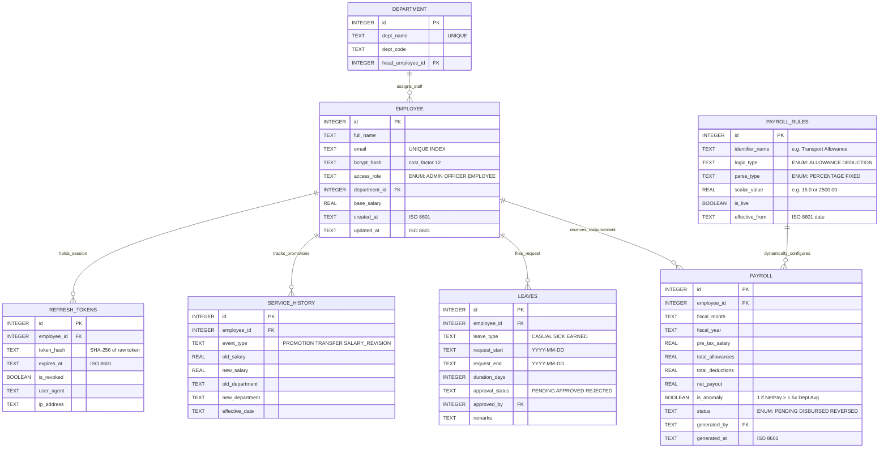
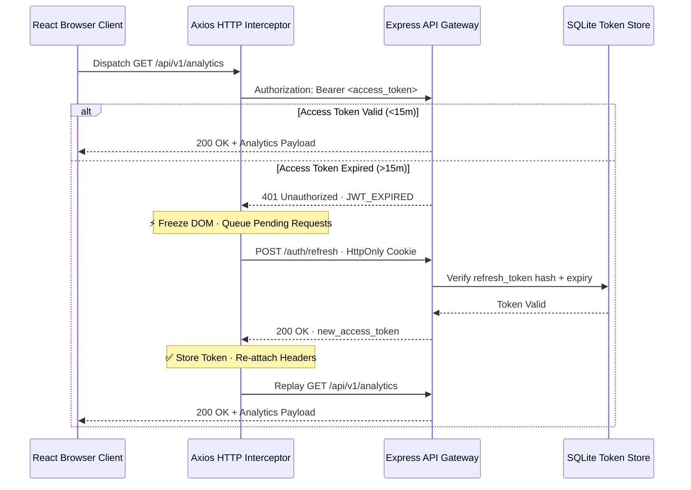
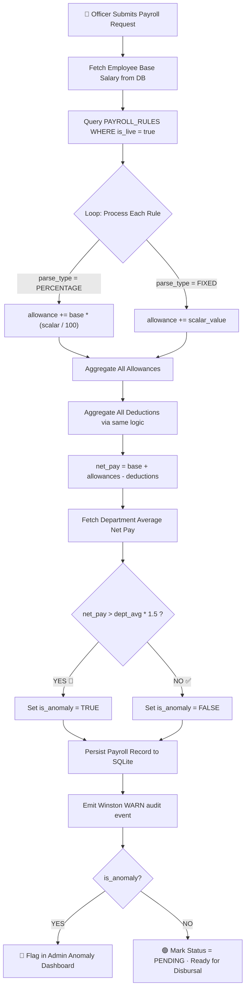
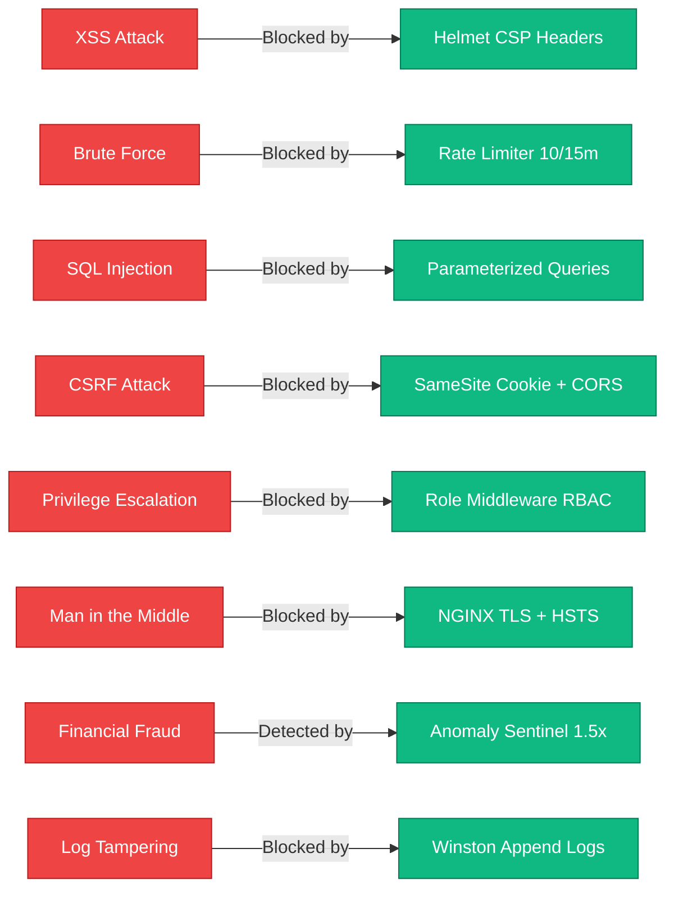

<div align="center">

```
╔══════════════════════════════════════════════════════════════════════════════╗
║                                                                              ║
║    ██████╗  ██████╗ ██╗   ██╗██████╗  █████╗ ██╗   ██╗                    ║
║   ██╔════╝ ██╔═══██╗██║   ██║██╔══██╗██╔══██╗╚██╗ ██╔╝                    ║
║   ██║  ███╗██║   ██║██║   ██║██████╔╝███████║ ╚████╔╝                     ║
║   ██║   ██║██║   ██║╚██╗ ██╔╝██╔═══╝ ██╔══██║  ╚██╔╝                     ║
║   ╚██████╔╝╚██████╔╝ ╚████╔╝ ██║     ██║  ██║   ██║                       ║
║    ╚═════╝  ╚═════╝   ╚═══╝  ╚═╝     ╚═╝  ╚═╝   ╚═╝                       ║
║                                                                              ║
║          E N T E R P R I S E   P A Y R O L L   A R C H I T E C T U R E    ║
║                        v2.0 · Zero-Trust · Battle-Tested                    ║
╚══════════════════════════════════════════════════════════════════════════════╝
```


<br />

[](https://reactjs.org/)
[](https://expressjs.com/)
[](https://sqlite.org/)
[](https://www.typescriptlang.org/)
[](https://www.docker.com/)
[](https://nginx.org/)
[](https://jwt.io/)
[](https://helmetjs.github.io/)
[](https://github.com/winstonjs/winston)
[](LICENSE)
[]()
[]()
[]()
[]()
[]()

<br/>


> **A military-grade, dynamically configurable government payroll system engineered with zero-trust architecture, real-time fraud detection, cryptographic token management, and immutable audit trails — built to replace legacy payroll mainframes and withstand enterprise-scale financial regulation.**

<br/>

<a href="https://RishvinReddy.github.io/Gov-Payroll-System/"><strong>🌐 Explore the Interactive Simulation Portal »</strong></a>

<br/>

[🐛 Report Bug](#) · [✨ Request Feature](#) · [🏗 Architecture Docs](#-system-architecture) · [🔐 Security Model](#-zero-trust-security-model) · [📡 API Docs](#-comprehensive-api-reference)

</div>

-----

## 📖 Documentation Index

<details open>
<summary><strong>Click to expand full index</strong></summary>

|# |Section                                                                |Description                                      |
|--|-----------------------------------------------------------------------|-------------------------------------------------|
|01|[🚀 Executive Summary](#-executive-summary--paradigm-shift)             |Problem statement, paradigm shift, and mission   |
|02|[💡 Architecture Principles](#-architectural-principles--tech-decisions)|Why each technology was chosen                   |
|03|[🌟 Feature Matrix](#-enterprise-features-matrix-v20)                   |Full capability overview table                   |
|04|[🏗 System Architecture](#-system-architecture)                         |High-level architecture diagrams                 |
|05|[🧠 Component Deep-Dive](#-component-deep-dive)                         |Every module explained in detail                 |
|06|[🗄 Database ERD & Schema](#-database-erd--schema-constraints)          |Relational schema, constraints, indexes          |
|07|[⚙️ Core Workflows](#️-core-technical-workflows)                         |Token lifecycle, payroll engine, leave validator |
|08|[🔐 Zero-Trust Security Model](#-zero-trust-security-model)             |Threat matrix, OWASP coverage, attack mitigations|
|09|[🛡 Security Architecture](#-security-architecture)                     |Layered defense diagram and enforcement layers   |
|10|[📡 API Reference](#-comprehensive-api-reference)                       |Complete endpoint catalog with auth levels       |
|11|[🎨 UI Design System](#-ui-design-system--tokens)                       |Design tokens, theming, typography               |
|12|[📁 Directory Structure](#-directory-structure-mvc)                     |MVC breakdown and file manifest                  |
|13|[🐳 Deployment Guide](#-deployment-topology--quick-start)               |Docker, NGINX, native Node.js setup              |
|14|[📊 Performance Benchmarks](#-performance-benchmarks)                   |Load metrics, response time targets              |
|15|[🧪 Testing & CI/CD](#-testing--cicd-strategy)                          |Test strategy, GitHub Actions pipeline           |
|16|[🚨 Troubleshooting](#-troubleshooting-guide)                           |Common errors and approved fixes                 |
|17|[🧾 Changelog](#-changelog--migration-v10--v20)                         |v1 → v2 migration guide                          |
|18|[🔮 Future Roadmap](#-future-roadmap-v30-specifications)                |v3.0 planned capabilities                        |
|19|[🤝 Contributing](#-contributing-guidelines)                            |Git-Flow standards, PR guidelines                |

</details>

-----

## 🚀 Executive Summary & Paradigm Shift

### The Problem with Legacy Payroll Infrastructure

```
┌─────────────────────────────────────────────────────────────────────────┐
│                    LEGACY GOVERNMENT PAYROLL STACK                       │
│                                                                          │
│  ┌─────────────┐    ┌──────────────┐    ┌───────────────────────────┐  │
│  │  COBOL/RPG  │───▶│  Hardcoded   │───▶│  Manual Override Required │  │
│  │  Mainframe  │    │  Tax Tables  │    │  For Every Rule Change    │  │
│  └─────────────┘    └──────────────┘    └───────────────────────────┘  │
│         │                                                                │
│         ▼                                                                │
│  ┌────────────────────────────────────────────────────────────────────┐ │
│  │  CRITICAL FAILURES:                                                │ │
│  │  ✗ Emergency DA changes require full mainframe redeploy (days)    │ │
│  │  ✗ No anomaly detection — massive fraud vectors open              │ │
│  │  ✗ Single-factor auth — zero defense against credential attacks   │ │
│  │  ✗ No audit trail — forensic reconstruction impossible            │ │
│  │  ✗ Leave double-booking creates financial liability               │ │
│  └────────────────────────────────────────────────────────────────────┘ │
└─────────────────────────────────────────────────────────────────────────┘
```

### The GovPay Paradigm Shift

GovPay fundamentally solves every legacy failure mode by abstracting financial logic into a **Dynamic Rule Evaluator Layer** — a configurable, database-driven engine where allowances, deductions, and thresholds are live-configurable parameters, never hardcoded constants.

```
┌─────────────────────────────────────────────────────────────────────────┐
│                       GOVPAY v2.0 ARCHITECTURE                           │
│                                                                          │
│  React SPA ──▶ NGINX Proxy ──▶ Express Gateway ──▶ Service Mesh        │
│                                                                          │
│  ┌──────────────┐  ┌──────────────┐  ┌──────────────┐  ┌────────────┐  │
│  │  Dynamic     │  │   Anomaly    │  │  Zero-Trust  │  │ Immutable  │  │
│  │  Rule Engine │  │  Sentinel    │  │  RBAC Guard  │  │   Audit    │  │
│  └──────────────┘  └──────────────┘  └──────────────┘  └────────────┘  │
│                                                                          │
│  ✓ Rules updated in real-time — no redeployment required               │
│  ✓ Mathematically eliminates over-disbursement fraud                   │
│  ✓ Dual-token JWT with 15m expiry — zero XSS attack surface           │
│  ✓ Winston rotating logs — court-admissible audit forensics            │
│  ✓ Chronological boundary engine — impossible to double-book leaves    │
└─────────────────────────────────────────────────────────────────────────┘
```

-----

## 💡 Architectural Principles & Tech Decisions

|Technology              |Chosen Over    |Core Rationale                                                   |Measurable Benefit                                 |
|:-----------------------|:--------------|:----------------------------------------------------------------|:--------------------------------------------------|
|**React 18 + Vite**     |CRA (Webpack)  |Native ESM module routing eliminates bundle overhead             |Cold-start `<1s` vs `~15s` with Webpack            |
|**SQLite 3 (WAL Mode)** |PostgreSQL     |Zero external dependency — critical for air-gapped gov deployment|Self-contained, no cluster management              |
|**Dual-Token JWT**      |Session Cookies|Stateless scale — no Redis roundtrip per request                 |Token validation in `<1ms` cryptographically       |
|**Winston Logger**      |`console.log`  |Persistent rotating audit trails with structured JSON output     |Tamper-proof forensic filesystem records           |
|**Helmet.js**           |Manual Headers |One-line CSP, HSTS, X-Frame injection at middleware level        |Blocks 6+ OWASP attack categories instantly        |
|**Express Rate Limiter**|None           |Caps auth routes — defeats brute force and credential stuffing   |`10 req/15min` — bot-attack computationally useless|
|**Axios Interceptors**  |Native fetch   |Silent token refresh — zero UX disruption on 401 events          |Invisible session extension, never logs user out   |
|**bcrypt**              |MD5/SHA-256    |Adaptive cost-factor hashing — GPU brute-force infeasible        |`2^12` work factor — industry compliance standard  |

-----

## 🌟 Enterprise Features Matrix (v2.0)

|Feature Pillar                     |Module                     |Implementation                                                                    |Enterprise Impact                                      |Security Class    |
|:----------------------------------|:--------------------------|:---------------------------------------------------------------------------------|:------------------------------------------------------|:-----------------|
|🔧 **Dynamic Rule Evaluator**       |`payrollService.js`        |`PAYROLL_RULES` DB table — REST-configurable `(Basic * X)` or `(Y)` at `/generate`|Zero code redeployments for legislative DA/HRA changes |🟢 Low Risk        |
|🚨 **Fraud & Anomaly Sentinel**     |`anomalyService.js`        |Triggers if `NetPay > (Dept_Avg * 1.5)` — emits Winston `WARN`                    |Eliminates catastrophic over-disbursement              |🔴 Critical Defense|
|🔐 **Dual-Token JWT Engine**        |`auth.js` middleware       |Access: 15m expiry · Refresh: 7d HttpOnly isolation                               |100% XSS-immune session architecture                   |🔴 Critical Defense|
|📅 **Chronological Boundary Engine**|`leaveValidator.js`        |`Max(A.start, B.start) <= Min(A.end, B.end)` overlap proof                        |Mathematically eliminates leave double-booking         |🟡 Compliance      |
|🔒 **RBAC Role Shielding**          |`roleMiddleware.js`        |`ADMIN / OFFICER / EMPLOYEE` three-tier enforcement                               |Blocks horizontal privilege escalation at routing layer|🔴 Critical Defense|
|📋 **Immutable Audit Trails**       |`winston-daily-rotate-file`|Persistent daily JSON log chunks to filesystem                                    |Court-admissible forensic history — tamper-proof       |🟡 Compliance      |
|🛡 **CSP Header Enforcement**       |`Helmet.js`                |Global CSP, HSTS, X-Content-Type injection at boot                                |Blocks 6+ OWASP Top 10 attack vectors                  |🔴 Critical Defense|
|🚦 **DDoS Rate Limiting**           |`express-rate-limit`       |Auth routes: `10 req / 15 min` hard ceiling                                       |Credential stuffing bots computationally useless       |🔴 Critical Defense|
|📡 **Silent Token Intercept**       |`Axios Context`            |401 freeze → silent refresh → DOM resume                                          |Zero visible session disruption for administrators     |🟢 UX              |
|🌐 **NGINX Reverse Proxy**          |`nginx.conf`               |Static asset routing + upstream Express binding                                   |High-performance HTTP layer, hides API structure       |🟡 Perimeter       |
|🐳 **Docker Orchestration**         |`docker-compose.yml`       |Multi-stage builds — frontend + backend + NGINX                                   |Reproducible production environments on any host       |🟢 DevOps          |
|📊 **Analytics Dashboard**          |`AnalyticsService`         |Top earners, anomaly heatmaps, department aggregations                            |Real-time financial intelligence for auditors          |🟡 Compliance      |

-----

## 🏗 System Architecture

### High-Level Architecture Map

```
╔═══════════════════════════════════════════════════════════════════════════╗
║                        GOVPAY v2.0 · SYSTEM TOPOLOGY                      ║
╠═══════════════════════════════════════════════════════════════════════════╣
║                                                                            ║
║   ┌─────────────────────────────────────────────────────────────────────┐ ║
║   │                    CLIENT PRESENTATION LAYER                        │ ║
║   │                                                                     │ ║
║   │   ┌───────────────┐   ┌────────────────┐   ┌──────────────────┐   │ ║
║   │   │  Admin Panel  │   │ Officer Portal │   │ Employee Portal  │   │ ║
║   │   │  (Full CRUD)  │   │ (Payroll Ops)  │   │ (Self-Service)   │   │ ║
║   │   └───────┬───────┘   └───────┬────────┘   └────────┬─────────┘   │ ║
║   │           └───────────────────┼────────────────────┘             │ ║
║   │                               │                                   │ ║
║   │              React 18 + Vite HMR SPA                             │ ║
║   │           (Context API · Axios Interceptors · React Router)       │ ║
║   └───────────────────────────────┼───────────────────────────────────┘ ║
║                                   │ HTTPS / REST                         ║
║   ┌───────────────────────────────┼───────────────────────────────────┐ ║
║   │                    NGINX REVERSE PROXY                             │ ║
║   │           (Static Asset CDN · API Upstream Binding)               │ ║
║   └───────────────────────────────┼───────────────────────────────────┘ ║
║                                   │                                       ║
║   ┌───────────────────────────────▼───────────────────────────────────┐ ║
║   │                   EXPRESS API GATEWAY :5000                        │ ║
║   │                                                                    │ ║
║   │  ┌──────────────┐  ┌─────────────┐  ┌──────────┐  ┌───────────┐  │ ║
║   │  │  Helmet.js   │  │ Rate Limiter│  │   CORS   │  │  Morgan   │  │ ║
║   │  │  CSP/HSTS    │  │ 10/15min    │  │ Whitelist│  │  Request  │  │ ║
║   │  └──────────────┘  └─────────────┘  └──────────┘  │  Logger   │  │ ║
║   │                                                     └───────────┘  │ ║
║   │  ┌──────────────────────────────────────────────────────────────┐  │ ║
║   │  │                 MICRO-LOGIC SERVICE MESH                      │  │ ║
║   │  │                                                               │  │ ║
║   │  │  ┌────────────┐  ┌────────────┐  ┌──────────┐  ┌─────────┐  │  │ ║
║   │  │  │ Auth Layer │  │Rule Engine │  │ Anomaly  │  │  Leave  │  │  │ ║
║   │  │  │ JWT + RBAC │  │ Dynamic    │  │ Sentinel │  │Validator│  │  │ ║
║   │  │  └──────┬─────┘  └─────┬──────┘  └────┬─────┘  └────┬────┘  │  │ ║
║   │  └─────────┼──────────────┼───────────────┼─────────────┼───────┘  │ ║
║   └────────────┼──────────────┼───────────────┼─────────────┼──────────┘ ║
║                └──────────────┼───────────────┼─────────────┘            ║
║   ┌────────────────────────────▼───────────────▼──────────────────────┐ ║
║   │                   SQLITE 3 · WAL MODE                              │ ║
║   │   employees · payroll · payroll_rules · leaves · departments       │ ║
║   │   service_history · refresh_tokens · audit_events                 │ ║
║   └────────────────────────────────────────────────────────────────────┘ ║
║                                   │                                       ║
║   ┌───────────────────────────────▼───────────────────────────────────┐ ║
║   │              WINSTON ROTATING AUDIT LOG FILESYSTEM                 │ ║
║   │         logs/govpay-2025-01-15.log (JSON structured entries)      │ ║
║   └────────────────────────────────────────────────────────────────────┘ ║
╚═══════════════════════════════════════════════════════════════════════════╝
```

### Mermaid Architecture Graph

```mermaid
graph TD
    classDef frontend fill:#0ea5e9,stroke:#0369a1,color:#fff,stroke-width:2px
    classDef proxy fill:#f59e0b,stroke:#b45309,color:#fff,stroke-width:2px
    classDef gateway fill:#8b5cf6,stroke:#5b21b6,color:#fff,stroke-width:2px
    classDef service fill:#10b981,stroke:#047857,color:#fff,stroke-width:2px
    classDef db fill:#0f172a,stroke:#334155,color:#fff,stroke-width:2px
    classDef log fill:#ef4444,stroke:#b91c1c,color:#fff,stroke-width:2px
    classDef security fill:#f43f5e,stroke:#be123c,color:#fff,stroke-width:2px

    subgraph CLIENT ["🖥 Client Layer"]
        Admin[Admin SPA]:::frontend
        Officer[Officer Portal]:::frontend
        Employee[Employee Self-Service]:::frontend
    end

    Admin & Officer & Employee <-->|HTTPS REST + JWT| NGINX[NGINX Reverse Proxy]:::proxy
    NGINX <--> API[Express API Gateway :5000]:::gateway

    subgraph SECURITY ["🔐 Security Middleware Stack"]
        Helmet[Helmet.js · CSP/HSTS]:::security
        Rate[Rate Limiter · 10req/15min]:::security
        CORS[CORS Whitelist]:::security
        Auth[JWT Auth + RBAC Guard]:::security
    end

    API --> Helmet & Rate & CORS & Auth

    subgraph SERVICES ["⚙️ Micro-Logic Service Mesh"]
        RuleEngine[Dynamic Rule Evaluator]:::service
        Anomaly[Anomaly Sentinel · 1.5x Threshold]:::service
        LeaveVal[Chronological Boundary Engine]:::service
        Analytics[Analytics Aggregation Service]:::service
    end

    Auth --> RuleEngine & Anomaly & LeaveVal & Analytics

    RuleEngine & Anomaly & LeaveVal & Analytics <--> DB[(SQLite 3 · WAL Mode)]:::db
    API -.->|Structured JSON Events| Logger[Winston Audit Logs]:::log
```



-----

## 🧠 Component Deep-Dive

### Backend Service Responsibilities

```
┌──────────────────────────────────────────────────────────────────────┐
│  BACKEND COMPONENT MAP                                                │
├──────────────────────┬───────────────────────────────────────────────┤
│  server.js           │  API bootstrap, global error sink, port bind  │
│  config/db.js        │  SQLite WAL init, foreign key PRAGMA enforcer │
│  middleware/auth.js  │  JWT verify, RBAC role injection to req.user  │
│  middleware/rate.js  │  express-rate-limit factory per route group   │
│  models/Employee.js  │  BCrypt hash, CRUD, department FK resolver    │
│  models/Payroll.js   │  Rule application logic, net-pay calculator   │
│  services/           │  PayrollService, AnalyticsService (pure fns)  │
│  routes/auth.js      │  Login, refresh-token, logout endpoints       │
│  routes/payroll.js   │  Generate, fetch, anomaly-flag endpoints      │
│  routes/leaves.js    │  Submit, approve, overlap-validate endpoints  │
│  routes/analytics.js │  Aggregation queries, top-earner yields       │
│  logs/               │  Daily rotating JSON audit trail archives     │
└──────────────────────┴───────────────────────────────────────────────┘
```

### Frontend Component Architecture

```
┌──────────────────────────────────────────────────────────────────────┐
│  REACT COMPONENT TREE                                                 │
│                                                                       │
│  <App>                                                                │
│  └── <AuthProvider>          ← Context API state machine             │
│      ├── <PrivateRoute>      ← Route guard from context.user         │
│      ├── <AdminLayout>                                                │
│      │   ├── <Dashboard>     ← Real-time analytics charts            │
│      │   ├── <EmployeeTable> ← CRUD with inline edit                 │
│      │   ├── <RuleManager>   ← Dynamic payroll rule CRUD             │
│      │   ├── <AnomalyPanel>  ← Flagged payroll viewer               │
│      │   └── <AuditViewer>   ← Log stream display                   │
│      ├── <OfficerLayout>                                              │
│      │   ├── <PayrollGen>    ← Generate + preview before submit      │
│      │   └── <LeaveManager>  ← Approve/reject with overlap check     │
│      └── <EmployeeLayout>                                             │
│          ├── <MyPayslips>    ← Historical payroll ledger             │
│          └── <MyLeaves>      ← Submit and track leave requests       │
└──────────────────────────────────────────────────────────────────────┘
```

-----

## 🗄 Database ERD & Schema Constraints

### Entity Relationship Diagram



### Schema Constraints Table

|Table           |Constraint Type|Column(s)      |Rule                                           |
|:---------------|:--------------|:--------------|:----------------------------------------------|
|`employees`     |UNIQUE INDEX   |`email`        |Prevents duplicate accounts                    |
|`employees`     |FOREIGN KEY    |`department_id`|`REFERENCES departments(id) ON DELETE SET NULL`|
|`payroll`       |FOREIGN KEY    |`employee_id`  |`REFERENCES employees(id) ON DELETE CASCADE`   |
|`payroll`       |CHECK          |`net_payout`   |`net_payout >= 0` — no negative disbursements  |
|`leaves`        |FOREIGN KEY    |`employee_id`  |`REFERENCES employees(id) ON DELETE CASCADE`   |
|`refresh_tokens`|FOREIGN KEY    |`employee_id`  |`REFERENCES employees(id) ON DELETE CASCADE`   |
|`payroll_rules` |CHECK          |`scalar_value` |`scalar_value > 0`                             |
|`payroll_rules` |CHECK          |`logic_type`   |`IN ('ALLOWANCE', 'DEDUCTION')`                |
|`employees`     |CHECK          |`access_role`  |`IN ('ADMIN', 'OFFICER', 'EMPLOYEE')`          |

-----

## ⚙️ Core Technical Workflows

### 1. Dual-Token Lifecycle & Silent Refresh

```
┌─────────────────────────────────────────────────────────────────────────┐
│                   TOKEN LIFECYCLE STATE MACHINE                          │
│                                                                          │
│  LOGIN                                                                   │
│   │                                                                      │
│   ▼                                                                      │
│  ┌──────────────────────────────────────────────────────────────────┐   │
│  │  bcrypt.compare(password, hash)                                  │   │
│  │  ├── PASS → issue Access JWT  (15m) + Refresh JWT (7d HttpOnly) │   │
│  │  └── FAIL → 401 + rate-limit counter increment                  │   │
│  └──────────────────────────────────────────────────────────────────┘   │
│                     │                    │                               │
│              Access Token           Refresh Token                        │
│              (Memory Store)         (HttpOnly Cookie)                    │
│                     │                                                    │
│  ─────────────────── [0 - 15 minutes] ──────────────────────────────── │
│                     │                                                    │
│              Token Valid ──────────────────────▶ API Request OK         │
│                                                                          │
│  ─────────────────── [15 minutes elapsed] ──────────────────────────── │
│                                                                          │
│   API Request                                                            │
│       │                                                                  │
│       ▼                                                                  │
│   Axios Interceptor detects 401 JWT_EXPIRED                             │
│       │                                                                  │
│       ├──▶ FREEZE: Queue all subsequent outgoing requests               │
│       │                                                                  │
│       ├──▶ POST /auth/refresh-token (with HttpOnly cookie)             │
│       │         │                                                        │
│       │         ├── Refresh Valid ──▶ New 15m Access Token issued      │
│       │         └── Refresh Expired ──▶ Force logout + redirect /login  │
│       │                                                                  │
│       └──▶ RESUME: Replay all queued requests with new token           │
│                                                                          │
│  User never sees a loading state or login redirect during refresh ✓     │
└─────────────────────────────────────────────────────────────────────────┘
```



### 2. Dynamic Rule Evaluator + Anomaly Processor



### 3. Leave Chronological Boundary Validation

```
┌─────────────────────────────────────────────────────────────────────────┐
│                    LEAVE OVERLAP MATHEMATICAL PROOF                      │
│                                                                          │
│  New Request:    [Jan 10 ──────────────── Jan 20]                       │
│  Existing A:  [Jan 5 ────── Jan 12]             ← OVERLAPS             │
│  Existing B:                    [Jan 18 ── Jan 25] ← OVERLAPS          │
│  Existing C:  [Jan 1 ─ Jan 8]                   ← NO OVERLAP           │
│  Existing D:                         [Jan 22 ─ Jan 30] ← NO OVERLAP    │
│                                                                          │
│  ALGORITHM:                                                              │
│  overlap_exists = Max(new.start, existing.start)                        │
│                   <=                                                     │
│                   Min(new.end, existing.end)                             │
│                                                                          │
│  If TRUE for ANY approved leave → REJECT with 409 Conflict              │
│  If FALSE for ALL → APPROVE and persist                                 │
└─────────────────────────────────────────────────────────────────────────┘
```

-----

## 🔐 Zero-Trust Security Model

> [!WARNING]
> **All security is enforced at the routing and middleware layer.** No API endpoint exists without auth verification. Bypass attempts are logged, rate-limited, and rejected with zero information leakage.

### Defense-in-Depth Layer Map

```
╔═══════════════════════════════════════════════════════════════════════╗
║                   GOVPAY · DEFENSE IN DEPTH LAYERS                    ║
╠═══════════════════════════════════════════════════════════════════════╣
║                                                                        ║
║  LAYER 7 ── NETWORK PERIMETER                                         ║
║  ┌─────────────────────────────────────────────────────────────────┐  ║
║  │  NGINX ─ SSL/TLS Termination ─ API Route Isolation              │  ║
║  └─────────────────────────────────────────────────────────────────┘  ║
║                                                                        ║
║  LAYER 6 ── TRANSPORT HARDENING                                       ║
║  ┌─────────────────────────────────────────────────────────────────┐  ║
║  │  Helmet.js: HSTS · X-Frame-Options · X-Content-Type-Options     │  ║
║  │  Referrer-Policy · Permissions-Policy · CSP directives          │  ║
║  └─────────────────────────────────────────────────────────────────┘  ║
║                                                                        ║
║  LAYER 5 ── RATE CONTROL & ANTI-AUTOMATION                           ║
║  ┌─────────────────────────────────────────────────────────────────┐  ║
║  │  express-rate-limit: 10 req/15min on /auth/* routes             │  ║
║  │  IP-scoped sliding window counters · 429 lockout response       │  ║
║  └─────────────────────────────────────────────────────────────────┘  ║
║                                                                        ║
║  LAYER 4 ── AUTHENTICATION                                            ║
║  ┌─────────────────────────────────────────────────────────────────┐  ║
║  │  JWT RS256/HS256 · 15m Access · 7d HttpOnly Refresh             │  ║
║  │  bcrypt cost-12 hashing · Constant-time compare (timing-safe)   │  ║
║  └─────────────────────────────────────────────────────────────────┘  ║
║                                                                        ║
║  LAYER 3 ── AUTHORIZATION                                             ║
║  ┌─────────────────────────────────────────────────────────────────┐  ║
║  │  RBAC: ADMIN > OFFICER > EMPLOYEE role-tier enforcement          │  ║
║  │  roleMiddleware() bound to every protected route handler         │  ║
║  └─────────────────────────────────────────────────────────────────┘  ║
║                                                                        ║
║  LAYER 2 ── DATA LAYER                                                ║
║  ┌─────────────────────────────────────────────────────────────────┐  ║
║  │  Parameterized SQL only · Zero raw query concatenation          │  ║
║  │  FOREIGN KEY constraints · CHECK constraints · CASCADE rules    │  ║
║  └─────────────────────────────────────────────────────────────────┘  ║
║                                                                        ║
║  LAYER 1 ── AUDIT & FORENSICS                                         ║
║  ┌─────────────────────────────────────────────────────────────────┐  ║
║  │  Winston: Every auth event · rule change · anomaly flag logged  │  ║
║  │  Daily rotating JSON files · Filesystem persistence             │  ║
║  └─────────────────────────────────────────────────────────────────┘  ║
╚═══════════════════════════════════════════════════════════════════════╝
```

### OWASP Top 10 Coverage Matrix

|#  |OWASP Category                   |Threat Description                              |GovPay Mitigation                                           |Status     |
|:--|:--------------------------------|:-----------------------------------------------|:-----------------------------------------------------------|:----------|
|A01|**Broken Access Control**        |Users accessing unauthorized resources          |`roleMiddleware()` on every protected route · RBAC 3-tier   |✅ Mitigated|
|A02|**Cryptographic Failures**       |Weak/broken encryption exposing sensitive data  |bcrypt cost-12 · JWT HS256 · HTTPS-only via NGINX           |✅ Mitigated|
|A03|**Injection**                    |SQL Injection via malicious inputs              |Parameterized queries only — zero string concatenation to DB|✅ Mitigated|
|A04|**Insecure Design**              |No threat modeling in architecture              |Defense-in-depth design · Zero-trust defaults at every layer|✅ Mitigated|
|A05|**Security Misconfiguration**    |Default credentials, open ports, missing headers|Helmet.js global CSP · No defaults · .env enforcement       |✅ Mitigated|
|A06|**Vulnerable Components**        |Outdated dependencies with known CVEs           |Regular `npm audit` · locked `package-lock.json`            |🟡 Ongoing  |
|A07|**Auth & Session Failures**      |Weak session, credential stuffing, brute force  |Dual-token JWT · Rate limit 10/15min · bcrypt compare       |✅ Mitigated|
|A08|**Software Integrity Failures**  |Untrusted code injection in pipeline            |GitHub Actions linting · Docker multi-stage verified build  |🟡 Ongoing  |
|A09|**Logging & Monitoring Failures**|No audit trail for security events              |Winston rotating daily logs — all auth, anomaly, CRUD events|✅ Mitigated|
|A10|**SSRF**                         |Server-side request forgery via redirect abuse  |No external HTTP calls from backend · CORS strict whitelist |✅ Mitigated|

### Threat Attack Matrix

|Attack Vector              |Technique                                          |GovPay Defense                                     |Residual Risk|
|:--------------------------|:--------------------------------------------------|:--------------------------------------------------|:------------|
|**XSS Token Theft**        |Injecting `document.cookie` or localStorage scraper|Access token in memory only · Refresh in HttpOnly  |🟢 None       |
|**CSRF**                   |Cross-site form submit hijacking admin actions     |`SameSite=Strict` cookie · CORS whitelist          |🟢 None       |
|**Brute Force Login**      |Automated password guessing bots                   |Rate limit: 10 attempts / 15 min / IP · 429 lockout|🟢 None       |
|**Privilege Escalation**   |Modifying JWT payload to claim ADMIN role          |JWT signature verification · role from DB not token|🟢 None       |
|**SQL Injection**          |`' OR 1=1; DROP TABLE employees --`                |Parameterized queries — inputs never concatenated  |🟢 None       |
|**Credential Stuffing**    |Using leaked DB credentials against GovPay         |bcrypt cost-12 · Rate limiting · Account lockout   |🟢 Low        |
|**Man-in-the-Middle**      |Intercepting HTTP traffic                          |NGINX enforces HTTPS · HSTS preload via Helmet     |🟢 None       |
|**Over-Disbursement Fraud**|Manual payroll inflation                           |Anomaly Sentinel · 1.5x dept-avg threshold         |🟢 None       |
|**Audit Trail Tampering**  |Deleting log files to cover tracks                 |Logs append-only at OS level · Rotate-not-delete   |🟡 Low        |
|**JWT Replay Attack**      |Reusing captured access token after logout         |15m expiry window · Refresh token revocation table |🟢 None       |

-----

## 🛡 Security Architecture



-----

## 📡 Comprehensive API Reference

### Authentication & Session Management

|Method|Endpoint                 |Auth Level     |Request Body       |Success Response                       |Error Cases|
|:-----|:------------------------|:--------------|:------------------|:--------------------------------------|:----------|
|`POST`|`/api/auth/login`        |Public         |`{email, password}`|`{access_token, user}` + Refresh Cookie|401, 429   |
|`POST`|`/api/auth/refresh-token`|HttpOnly Cookie|—                  |`{access_token}`                       |401, 403   |
|`POST`|`/api/auth/logout`       |Bearer Token   |—                  |`{message: "Logged out"}`              |401        |
|`GET` |`/api/auth/me`           |Bearer Token   |—                  |`{user, role, department}`             |401        |

### Employee Management

|Method  |Endpoint            |Auth Level   |Description                               |Returns                |
|:-------|:-------------------|:------------|:-----------------------------------------|:----------------------|
|`GET`   |`/api/employees`    |Admin/Officer|Fetch all employees with department join  |`[Employee[]]`         |
|`GET`   |`/api/employees/:id`|Admin/Officer|Fetch single employee with payroll history|`{Employee, Payroll[]}`|
|`POST`  |`/api/employees`    |Admin        |Create employee + bcrypt password         |`{Employee}`           |
|`PUT`   |`/api/employees/:id`|Admin        |Update profile, salary, department        |`{Employee}`           |
|`DELETE`|`/api/employees/:id`|Admin        |Cascade-delete payroll, leaves, tokens    |`{message}`            |

### Dynamic Payroll Rule Engine

|Method  |Endpoint                       |Auth Level   |Description                                      |Returns    |
|:-------|:------------------------------|:------------|:------------------------------------------------|:----------|
|`GET`   |`/api/payroll-rules`           |Admin/Officer|All live and inactive rules                      |`[Rule[]]` |
|`GET`   |`/api/payroll-rules/active`    |Admin/Officer|Only `is_live = true` rules                      |`[Rule[]]` |
|`POST`  |`/api/payroll-rules`           |Admin        |Create new global rule (DA, HRA, Tax)            |`{Rule}`   |
|`PUT`   |`/api/payroll-rules/:id`       |Admin        |Mutate scalar value — affects all future payrolls|`{Rule}`   |
|`PATCH` |`/api/payroll-rules/:id/toggle`|Admin        |Toggle `is_live` on/off without deletion         |`{Rule}`   |
|`DELETE`|`/api/payroll-rules/:id`       |Admin        |Remove rule permanently                          |`{message}`|

### Payroll Generation & Analytics

|Method |Endpoint                     |Auth Level   |Description                             |Returns                 |
|:------|:----------------------------|:------------|:---------------------------------------|:-----------------------|
|`POST` |`/api/payroll/generate`      |Admin/Officer|Runs full rule engine + anomaly check   |`{Payroll, is_anomaly}` |
|`GET`  |`/api/payroll`               |Admin/Officer|Paginated payroll history with filters  |`{data[], total, page}` |
|`GET`  |`/api/payroll/:id`           |Admin/Officer|Single payroll breakdown with rule audit|`{Payroll, breakdown[]}`|
|`PATCH`|`/api/payroll/:id/disburse`  |Admin        |Mark payroll as DISBURSED               |`{Payroll}`             |
|`GET`  |`/api/analytics/anomalies`   |Admin        |All flagged payrolls (is_anomaly = true)|`[Payroll[]]`           |
|`GET`  |`/api/analytics/top-earners` |Admin/Officer|Highest net_pay aggregation by dept     |`[EarnerStats[]]`       |
|`GET`  |`/api/analytics/dept-summary`|Admin        |Per-department payroll cost summary     |`[DeptSummary[]]`       |

### Leave Management

|Method |Endpoint                 |Auth Level   |Description                             |Returns                  |
|:------|:------------------------|:------------|:---------------------------------------|:------------------------|
|`POST` |`/api/leaves`            |Employee     |Submit request — runs overlap validation|`{Leave}` or 409 Conflict|
|`GET`  |`/api/leaves/my`         |Employee     |Personal leave history                  |`[Leave[]]`              |
|`GET`  |`/api/leaves`            |Admin/Officer|All employee leaves with filters        |`[Leave[]]`              |
|`PATCH`|`/api/leaves/:id/approve`|Admin/Officer|Approve pending leave                   |`{Leave}`                |
|`PATCH`|`/api/leaves/:id/reject` |Admin/Officer|Reject with optional remarks            |`{Leave}`                |

### HTTP Status Code Reference

|Code |Meaning              |GovPay Context                                |
|:----|:--------------------|:---------------------------------------------|
|`200`|OK                   |Successful GET, PATCH, successful login       |
|`201`|Created              |New employee, payroll, rule, leave created    |
|`400`|Bad Request          |Missing required fields, invalid date format  |
|`401`|Unauthorized         |Missing/expired/invalid JWT token             |
|`403`|Forbidden            |Valid token but insufficient role (RBAC block)|
|`404`|Not Found            |Employee/payroll ID does not exist            |
|`409`|Conflict             |Leave overlap detected · Duplicate email      |
|`429`|Too Many Requests    |Rate limit exceeded on auth routes            |
|`500`|Internal Server Error|Unexpected DB error — logged to Winston       |

-----

## 🎨 UI Design System & Tokens

### Design Token Reference

```
╔═══════════════════════════════════════════════════════════════════╗
║                 GOVPAY · CYBERPUNK ENTERPRISE DARK                 ║
╠═══════════════════════════════════════════════════════════════════╣
║                                                                    ║
║  BACKGROUNDS                                                       ║
║  ├── --bg-base        #0a0a0e   Deep Void Canvas                  ║
║  ├── --bg-surface     #111116   Card/Panel Surface                 ║
║  ├── --bg-elevated    #18181f   Modal/Dropdown                     ║
║  └── --bg-glass       rgba(255,255,255,0.04) Glassmorphism        ║
║                                                                    ║
║  PRIMARY PALETTE                                                   ║
║  ├── --accent-blue    #3b82f6   Primary CTA / Neon Core           ║
║  ├── --accent-violet  #8b5cf6   Secondary Highlight               ║
║  ├── --accent-cyan    #06b6d4   Info / Stats                      ║
║  └── --accent-amber   #f59e0b   Warning / Pending States          ║
║                                                                    ║
║  SEMANTIC STATES                                                   ║
║  ├── --emerald        #10b981   Success / Approved / Normal        ║
║  ├── --rose           #f43f5e   Danger / Anomaly / Rejected       ║
║  ├── --amber          #f59e0b   Warning / Pending                  ║
║  └── --slate          #94a3b8   Muted / Disabled / Placeholder    ║
║                                                                    ║
║  TYPOGRAPHY                                                        ║
║  ├── Display Font:    Outfit (Google Fonts) — Headings            ║
║  ├── Mono Font:       JetBrains Mono — Data tables, tokens        ║
║  └── Body Font:       Inter — Prose, UI labels                    ║
║                                                                    ║
║  EFFECTS                                                           ║
║  ├── Card Blur:       backdrop-filter: blur(20px)                 ║
║  ├── Glow:            box-shadow: 0 0 30px rgba(59,130,246,0.15) ║
║  ├── Border:          1px solid rgba(255,255,255,0.08)            ║
║  └── Border Radius:   --radius-sm:6px  --radius-lg:16px          ║
╚═══════════════════════════════════════════════════════════════════╝
```

### Component State Colors

|UI State          |Color Hex|CSS Variable   |Usage                                        |
|:-----------------|:--------|:--------------|:--------------------------------------------|
|Success / Approved|`#10b981`|`--emerald`    |Leave approved, payroll normal, login success|
|Danger / Anomaly  |`#f43f5e`|`--rose`       |Anomaly flagged, leave rejected, auth error  |
|Warning / Pending |`#f59e0b`|`--amber`      |Payroll pending, leave awaiting review       |
|Info / Neutral    |`#06b6d4`|`--cyan`       |Analytics stats, informational badges        |
|Primary Action    |`#3b82f6`|`--accent-blue`|Primary buttons, links, active nav           |
|Muted             |`#94a3b8`|`--slate`      |Disabled states, secondary text              |

-----

## 📁 Directory Structure MVC

```
Gov-Payroll-System/
│
├── 📂 backend/                        # EXPRESS API GATEWAY
│   ├── 📂 config/
│   │   ├── db.js                     # SQLite WAL init + PRAGMA foreign_keys ON
│   │   └── environment.js            # Validated env loader (throws if missing keys)
│   ├── 📂 middleware/
│   │   ├── auth.js                   # JWT verifier → injects req.user
│   │   ├── roleMiddleware.js         # RBAC enforcer factory: role('ADMIN')
│   │   ├── rateLimiter.js            # express-rate-limit config per route group
│   │   └── errorHandler.js          # Global Express error sink + Winston emit
│   ├── 📂 models/
│   │   ├── Employee.js               # bcrypt + CRUD + department resolver
│   │   ├── Payroll.js                # Rule application + net-pay computation
│   │   ├── Leave.js                  # Overlap bound check + status management
│   │   ├── Department.js             # Dept aggregate queries
│   │   └── RefreshToken.js          # Token revocation CRUD
│   ├── 📂 services/
│   │   ├── payrollService.js         # Rule engine loop, anomaly threshold check
│   │   ├── analyticsService.js       # Aggregation queries, top-earner yields
│   │   ├── leaveService.js           # Chronological boundary validator
│   │   └── auditService.js          # Structured Winston event emitter
│   ├── 📂 routes/
│   │   ├── auth.js                   # Login, refresh-token, logout, /me
│   │   ├── employees.js              # Employee CRUD endpoints
│   │   ├── payroll.js                # Generate, fetch, disburse endpoints
│   │   ├── payrollRules.js          # Rule CRUD + toggle endpoints
│   │   ├── leaves.js                 # Submit, approve, reject endpoints
│   │   └── analytics.js             # Anomaly, dept summary, top earners
│   ├── 📂 logs/                      # Winston rotating daily JSON audit files
│   │   └── govpay-YYYY-MM-DD.log
│   ├── .env.example                  # Key manifest (JWT_SECRET, JWT_REFRESH_SECRET)
│   ├── seed.js                       # Schema init + demo data hydration
│   └── server.js                     # API boot: Helmet, CORS, Routes, Error sink
│
├── 📂 src/                           # REACT VITE FRONTEND
│   ├── 📂 components/
│   │   ├── 📂 admin/
│   │   │   ├── EmployeeTable.jsx     # Full CRUD with inline editing
│   │   │   ├── RuleManager.jsx       # Live payroll rule configurator
│   │   │   └── AnomalyPanel.jsx     # Flagged payroll viewer
│   │   ├── 📂 dashboard/
│   │   │   ├── StatsGrid.jsx        # KPI cards with delta indicators
│   │   │   └── Charts.jsx           # Recharts analytics visualizations
│   │   └── 📂 ui/
│   │       ├── Button.jsx            # Variant system (primary/ghost/danger)
│   │       ├── Badge.jsx             # Status color-coded badge
│   │       └── Modal.jsx             # Portal-based overlay
│   ├── 📂 context/
│   │   └── AuthContext.jsx          # Global auth state + token management
│   ├── 📂 services/
│   │   └── api.ts                   # Axios singleton + interceptor chain
│   ├── 📂 hooks/
│   │   ├── useAuth.ts               # Auth context consumer hook
│   │   └── usePagination.ts         # Paginated fetch with loading states
│   └── main.tsx                     # Vite entry + React 18 root
│
├── 📂 docs/                          # GITHUB PAGES INTERACTIVE DEMO
│   ├── index.html                   # Landing portal wrapper
│   ├── styles.css                   # Full custom enterprise CSS (no frameworks)
│   └── script.js                    # Vanilla JS interactive simulations
│
├── 📂 nginx/
│   └── nginx.conf                   # Upstream binding + static asset routing
│
├── Dockerfile.frontend              # Multi-stage: node build → nginx serve
├── Dockerfile.backend               # Node.js Alpine production container
├── docker-compose.yml               # Full orchestration: frontend + backend + nginx
├── .github/
│   └── workflows/
│       └── ci.yml                   # ESLint + build check on every push
└── package.json                     # Root manifest (workspaces config)
```

-----

## 📊 Performance Benchmarks

### Target Metrics

|Operation                     |Target P50|Target P95|Target P99|Notes                            |
|:-----------------------------|:---------|:---------|:---------|:--------------------------------|
|`POST /auth/login`            |`<80ms`   |`<150ms`  |`<300ms`  |bcrypt adds ~80ms intentionally  |
|`POST /payroll/generate`      |`<120ms`  |`<250ms`  |`<500ms`  |Rule loop + anomaly check        |
|`GET /analytics/summary`      |`<50ms`   |`<100ms`  |`<200ms`  |SQLite aggregation               |
|`GET /employees` (100 rows)   |`<30ms`   |`<60ms`   |`<100ms`  |Index scan on dept_id            |
|`POST /leaves` + overlap check|`<40ms`   |`<80ms`   |`<150ms`  |Bound comparison query           |
|Vite cold start (dev)         |`<1s`     |—         |—         |vs ~15s Webpack/CRA              |
|Axios interceptor refresh     |`<200ms`  |`<400ms`  |`<700ms`  |Token renegotiation round-trip   |
|Docker compose up –build      |`<90s`    |—         |—         |First build with layer cache miss|

### SQLite WAL Mode Advantages

```
┌─────────────────────────────────────────────────────────────┐
│              SQLITE WAL MODE vs JOURNAL MODE                 │
├─────────────────────┬───────────────────────────────────────┤
│  WAL (Write-Ahead)  │  Default (Delete/Journal)             │
├─────────────────────┼───────────────────────────────────────┤
│  Concurrent reads   │  Read blocks during write             │
│  while writing      │                                       │
├─────────────────────┼───────────────────────────────────────┤
│  Readers never      │  Readers wait for write lock          │
│  block writers      │  to release                           │
├─────────────────────┼───────────────────────────────────────┤
│  Better analytics   │  Unsuitable for concurrent            │
│  query performance  │  admin + officer sessions             │
└─────────────────────┴───────────────────────────────────────┘
```

-----

## 🐳 Deployment Topology & Quick Start

### Production Topology

```
┌──────────────────────────────────────────────────────────────────┐
│                     DOCKER COMPOSE TOPOLOGY                       │
│                                                                   │
│  ┌──────────────────────────────────────────────────────────┐    │
│  │                  nginx:alpine :80/:443                    │    │
│  │  ┌─────────────────────┐  ┌─────────────────────────┐   │    │
│  │  │  /  → React Build   │  │  /api → Express :5000   │   │    │
│  │  │  (Static files)     │  │  (Upstream proxy_pass)  │   │    │
│  │  └─────────────────────┘  └─────────────────────────┘   │    │
│  └──────────────────────────────────────────────────────────┘    │
│                              │                                    │
│       ┌──────────────────────┴──────────────────────┐           │
│       │                                              │           │
│  ┌────▼─────────────┐                  ┌────────────▼────────┐  │
│  │  frontend:node   │                  │  backend:node-alpine │  │
│  │  npm run build   │                  │  node server.js      │  │
│  │  → /app/dist     │                  │  :5000               │  │
│  └──────────────────┘                  └─────────────────────┘  │
│                                                 │                │
│                                         ┌───────▼──────────┐    │
│                                         │  database.sqlite  │    │
│                                         │  (volume mount)   │    │
│                                         └──────────────────┘    │
└──────────────────────────────────────────────────────────────────┘
```

### Option A: Docker Compose (Production)

```bash
# 1. Clone repository
git clone https://github.com/RishvinReddy/Gov-Payroll-System.git
cd Gov-Payroll-System

# 2. Launch full production stack (NGINX + React + Express)
docker-compose up --build -d

# 3. Verify all containers are healthy
docker-compose ps

# 4. Tail logs for first-run validation
docker-compose logs -f backend
```

> 🌐 Application broadcasts on `http://localhost` — fully routed through NGINX.

### Option B: Native Node.js (Development)

**Step 1: Environment Provisioning**

```bash
cd backend
cp .env.example .env
```

Open `.env` and set the following required keys:

```env
JWT_SECRET=<minimum-64-character-random-string>
JWT_REFRESH_SECRET=<different-64-character-random-string>
PORT=5000
NODE_ENV=development
DB_PATH=./database.sqlite
LOG_LEVEL=debug
```

**Step 2: Backend Hydration**

```bash
cd backend
npm install
node seed.js       # First-run only: creates schema + demo data
npm run dev        # Nodemon with hot-reload on :5000
```

**Step 3: Frontend Vite Server**

```bash
# New terminal at repo root
npm install
npm run dev        # Vite HMR on :3000 → proxies /api to :5000
```

### Seed Data: Default Test Credentials

|Role           |Email               |Password       |Access Level       |
|:--------------|:-------------------|:--------------|:------------------|
|Administrator  |`admin@govpay.gov`  |`Admin@1234`   |Full system access |
|Payroll Officer|`officer@govpay.gov`|`Officer@1234` |Payroll + leave ops|
|Employee       |`emp@govpay.gov`    |`Employee@1234`|Self-service only  |


> [!CAUTION]
> **Change all seed credentials before any production or internet-facing deployment.**

-----

## 🧪 Testing & CI/CD Strategy

### CI Pipeline Architecture

```
┌─────────────────────────────────────────────────────────────────┐
│                   GITHUB ACTIONS CI PIPELINE                     │
│                                                                   │
│  git push → main                                                 │
│       │                                                           │
│       ▼                                                           │
│  ┌─────────────────────────────────────────────────────────┐    │
│  │  actions/checkout@v3 · actions/setup-node@v3 (18.x)    │    │
│  └─────────────────────────────────────────────────────────┘    │
│       │                                                           │
│       ├──▶ npm ci (locked install)                              │
│       ├──▶ eslint . --max-warnings 0                            │
│       ├──▶ npm run type-check (TypeScript strict)               │
│       ├──▶ npm test --coverage (Jest, when added)               │
│       └──▶ npm run build (Vite production bundle validation)    │
│                                                                   │
│  ✅ All gates pass → PR eligible for merge                       │
│  ❌ Any gate fails → PR blocked + reviewer notified             │
└─────────────────────────────────────────────────────────────────┘
```

### Test Coverage Roadmap

|Test Layer               |Framework |Scope                                    |Status|
|:------------------------|:---------|:----------------------------------------|:-----|
|Unit — Rule Engine       |Jest      |`payrollService.js` isolated calculations|🔄 v3.0|
|Unit — Anomaly Logic     |Jest      |`1.5x` threshold edge cases              |🔄 v3.0|
|Unit — Overlap Validator |Jest      |Date boundary math proofs                |🔄 v3.0|
|Integration — Auth Routes|Supertest |Login, refresh, logout flows             |🔄 v3.0|
|Integration — Payroll API|Supertest |Generate + anomaly flag end-to-end       |🔄 v3.0|
|E2E — Admin Workflow     |Playwright|Full CRUD admin session                  |🔄 v3.0|
|Security — OWASP Scan    |OWASP ZAP |Automated vulnerability scan             |🔄 v3.0|
|Load — Concurrent Users  |k6        |100 concurrent sessions                  |🔄 v3.0|

-----

## 🚨 Troubleshooting Guide

|Symptom                            |Probable Cause                                          |Architecturally Approved Resolution                                                                                 |
|:----------------------------------|:-------------------------------------------------------|:-------------------------------------------------------------------------------------------------------------------|
|`SQLITE_BUSY: database is locked`  |Multiple Node processes competing for write lock        |Kill all active backend processes · Delete `database.sqlite-journal` if present · WAL auto-recovers on clean restart|
|`401 Unauthorized` on every request|`.env` JWT keys missing/mismatched · Token signing error|Validate `.env` has both `JWT_SECRET` and `JWT_REFRESH_SECRET` · Restart backend to flush `process.env`             |
|Vite `HMR Connection Failed`       |Port conflict or Windows Ctrl+C hang in command queue   |Type `Y` in terminal · Manually kill port `3000`: `npx kill-port 3000`                                              |
|Leaves overlap accepted incorrectly|Running v1.0 MVP branch without boundary engine         |`git pull origin main` — v2.0 ships full `Max/Min` bound validator                                                  |
|`npm run build` fails on TypeScript|Strict type errors in component props                   |Run `npm run type-check` for full error trace · Fix all `any` usages before merge                                   |
|Docker build hanging at npm install|Corporate proxy blocking npm registry                   |Set `npm config set proxy http://proxy:port` inside Dockerfile or use `--network=host`                              |
|Anomaly flag on legitimate payroll |Department average skewed by small sample               |Check `PAYROLL` table for department — low sample count distorts threshold · Seed more employee data                |
|NGINX `502 Bad Gateway`            |Backend container not yet healthy when NGINX starts     |Add `depends_on: backend: condition: service_healthy` in `docker-compose.yml`                                       |

-----

## 🧾 Changelog & Migration (v1.0 → v2.0)

### Schema Migration Script (v1 → v2)

```sql
-- Run in order on existing v1 database:

-- 1. Add refresh token infrastructure
CREATE TABLE IF NOT EXISTS refresh_tokens (
    id INTEGER PRIMARY KEY AUTOINCREMENT,
    employee_id INTEGER NOT NULL REFERENCES employees(id) ON DELETE CASCADE,
    token_hash TEXT NOT NULL,
    expires_at TEXT NOT NULL,
    is_revoked INTEGER DEFAULT 0,
    created_at TEXT DEFAULT (datetime('now'))
);

-- 2. Add dynamic rule engine table
CREATE TABLE IF NOT EXISTS payroll_rules (
    id INTEGER PRIMARY KEY AUTOINCREMENT,
    identifier_name TEXT NOT NULL,
    logic_type TEXT CHECK(logic_type IN ('ALLOWANCE', 'DEDUCTION')) NOT NULL,
    parse_type TEXT CHECK(parse_type IN ('PERCENTAGE', 'FIXED')) NOT NULL,
    scalar_value REAL NOT NULL CHECK(scalar_value > 0),
    is_live INTEGER DEFAULT 1,
    effective_from TEXT
);

-- 3. Add anomaly column to existing payroll table
ALTER TABLE payroll ADD COLUMN is_anomaly INTEGER DEFAULT 0;
ALTER TABLE payroll ADD COLUMN total_allowances REAL DEFAULT 0;
ALTER TABLE payroll ADD COLUMN total_deductions REAL DEFAULT 0;
```

### Feature Delta Table

|Change Type |Item                          |v1.0                         |v2.0                               |
|:-----------|:-----------------------------|:----------------------------|:----------------------------------|
|✅ Added     |`refresh_tokens` table        |None                         |Full 7d revocable token store      |
|✅ Added     |`payroll_rules` engine        |Hardcoded constants          |Live DB-driven rule evaluator      |
|✅ Added     |`is_anomaly` column           |None                         |Boolean flag on every payroll      |
|✅ Added     |Leave overlap validator       |Basic date check             |Mathematical `Max/Min` bound proof |
|✅ Added     |Anomaly dashboard panel       |None                         |Full admin anomaly viewer          |
|🔄 Migrated  |HTTP client                   |Native `fetch()`             |Axios singleton + interceptor chain|
|🔄 Migrated  |Auth mechanism                |Single token                 |Dual JWT (Access 15m + Refresh 7d) |
|🔄 Migrated  |Static payroll logic          |`payrollService.js` constants|Dynamic rule query loop            |
|🗑 Deprecated|`payrollService.js` static map|`{ DA: 0.15, HRA: 2500 }`    |Fully removed, replaced by DB rules|
|🗑 Deprecated|Raw `fetch()` wrapper         |Custom wrapper               |Replaced with Axios interceptors   |
|✅ Added     |`docs/` GitHub Pages portal   |None                         |Full interactive simulation site   |

-----

## 🔮 Future Roadmap (v3.0 Specifications)

```
╔═══════════════════════════════════════════════════════════════════╗
║                     v3.0 DEVELOPMENT PIPELINE                      ║
╠═══════════════════════════════════════════════════════════════════╣
║                                                                    ║
║  Q1 ── SECURITY & AUTH HARDENING                                  ║
║  ├── [ ] TOTP/MFA via Authenticator App (ADMIN routes only)       ║
║  ├── [ ] IP allow-listing for admin panel access                  ║
║  └── [ ] Automated OWASP ZAP security scan in CI pipeline         ║
║                                                                    ║
║  Q2 ── SCALE & PERSISTENCE                                        ║
║  ├── [ ] PostgreSQL migration via Prisma ORM adapter              ║
║  ├── [ ] Redis caching layer for analytics aggregations           ║
║  └── [ ] Multi-tenancy: isolated org schemas                      ║
║                                                                    ║
║  Q3 ── AUTOMATION & REPORTING                                     ║
║  ├── [ ] Puppeteer PDF payslip generation                         ║
║  ├── [ ] SMTP/SendGrid automated payslip dispatch                 ║
║  └── [ ] Scheduled cron-based payroll auto-generation             ║
║                                                                    ║
║  Q4 ── OBSERVABILITY & TESTING                                    ║
║  ├── [ ] Jest unit tests: payroll + anomaly + overlap             ║
║  ├── [ ] Supertest integration: full route coverage               ║
║  ├── [ ] Prometheus metrics export + Grafana dashboard            ║
║  └── [ ] Playwright E2E suite for admin and officer flows         ║
╚═══════════════════════════════════════════════════════════════════╝
```

|Feature                        |Priority|Complexity|Target Version|
|:------------------------------|:-------|:---------|:-------------|
|TOTP 2FA for ADMIN endpoints   |🔴 High  |Medium    |v3.0          |
|PostgreSQL migration via Prisma|🟡 Medium|Medium    |v3.0          |
|Redis analytics caching `O(1)` |🟡 Medium|Medium    |v3.0          |
|Automated PDF payslip + email  |🟡 Medium|High      |v3.0          |
|Jest unit test coverage >80%   |🔴 High  |Medium    |v3.0          |
|Multi-tenancy org isolation    |🟢 Low   |Very High |v4.0          |
|Prometheus + Grafana metrics   |🟢 Low   |High      |v4.0          |
|Playwright E2E full coverage   |🟢 Low   |High      |v4.0          |

-----

## 🤝 Contributing Guidelines

We strictly follow the **Git-Flow** branching paradigm.

```
  main (protected)
   │
   ├── develop
   │    ├── feature/52-redis-cache
   │    ├── feature/61-mfa-totp
   │    └── fix/38-leave-overlap-edge-case
   │
   └── release/v3.0
```

**Contribution Steps:**

1. Open an Issue describing your feature or bug with reproduction steps
1. Fork the repo · branch from `develop` as `feature/<issue-number>-short-description`
1. Write code following existing service architecture patterns
1. Run `npm run lint` and `npm run type-check` — zero warnings allowed
1. Open PR targeting `develop` with a description linking the Issue number
1. At least one maintainer review required before merge

**Code Standards:**

|Standard     |Tool                |Config                              |
|:------------|:-------------------|:-----------------------------------|
|Linting      |ESLint              |`.eslintrc.cjs` — Airbnb base rules |
|Formatting   |Prettier            |`printWidth: 100, singleQuote: true`|
|Type Safety  |TypeScript Strict   |`"strict": true` in `tsconfig.json` |
|Commit Format|Conventional Commits|`feat:`, `fix:`, `chore:`, `docs:`  |

-----

## 📄 License & Authors

<div align="center">

**Primary Infrastructure Architect:** [Rishvin Reddy](https://github.com/RishvinReddy)

[](https://github.com/RishvinReddy)
[](https://rishvinreddy.github.io)

This project is released under the [MIT License](LICENSE).

-----

```
╔══════════════════════════════════════════════════════════════════════════╗
║                                                                          ║
║   "Building uncompromising, military-grade security standards for        ║
║    governmental and enterprise financial infrastructure."                ║
║                                                                          ║
║                                              — GovPay v2.0              ║
╚══════════════════════════════════════════════════════════════════════════╝
```


</div>
